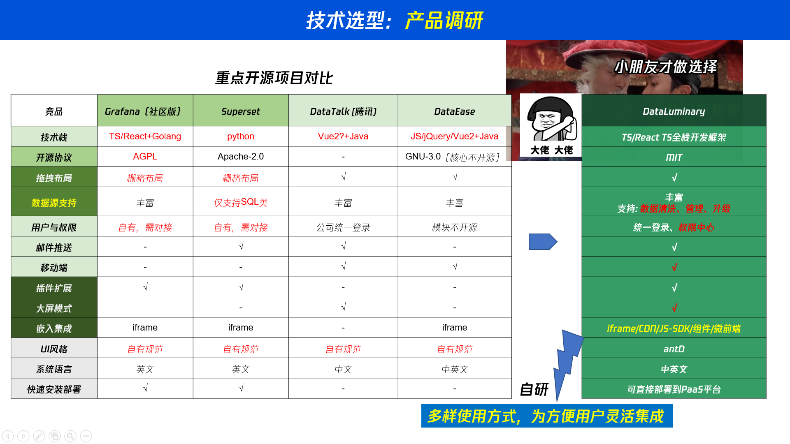

# 竞品对比

下图从数据链路、插件化、AI、私有化与嵌入等维度，对照 Grafana、Apache Superset、DataTalk、DataEase、DataView 与 **DataLuminary（本品）**。

## 本品优势（相对各列）

| 对照对象 | 对方强项 | DataLuminary 差异化 |
|----------|----------|---------------------|
| **Grafana** | 时序监控、告警生态成熟 | 面向经营 BI：数据集语义层 + NoCode/AI 配图；整页布局覆盖网格 / 大屏 / 移动；分享含嵌入与订阅推送，不只运维看板 |
| **Superset** | SQL 探索、图表类型丰富 | 微内核插件（数据源 / 图表 / 仪表盘 / 布局 / 交互）+ 全栈 TypeScript，利于二次开发与 AI 协作改 Schema；默认统一身份与企业 SSO |
| **DataTalk** | 偏查询 / 数据服务能力 | 本品将 DataTalk 作为后端查询与连接中枢，与 DataView 编排放同一产品闭环，而不是「只有 API、没有完整 BI 创作与分发」 |
| **DataEase** | 国产开源 BI、上手快 | 架构上坚持「图表不直连数据源、统一走数据集」；交互为状态驱动派生，而非事件互抛；布局插件与 Focus 编辑适合门户 + 大屏共栈 |
| **DataView** | 可视化编辑体验 | DataView 是本品前端；单独对比时，本品补齐 DataTalk 查询治理、权限（Casbin）、分享令牌、订阅无头渲染与生态账号，形成可私有化交付的完整平台 |

### 一句话总结

**DataLuminary = DataView（创作与可视化）+ DataTalk（查询与连接）+ 插件契约 + 统一身份 / 资源权限 + 嵌入 / 订阅分发。**

相对「监控型 Grafana」「SQL 探索型 Superset」「开箱报表型 DataEase」，本品更强调：

1. **同一语义资产**：数据源 → 数据集 → 图表 → 仪表盘，口径可复用、可审计。  
2. **插件化扩展**：场景差异用插件吸收，不改内核。  
3. **全栈 TypeScript**：前后端与 Schema 同语言，降低定制与 AI 辅助改代码成本。  
4. **可嵌入、可推送**：业务系统拉看板，邮件推快照，两条分发路径并存。

迁入说明：[Grafana 迁入](./grafana.md) · [DataEase 迁入](./dataease.md)
