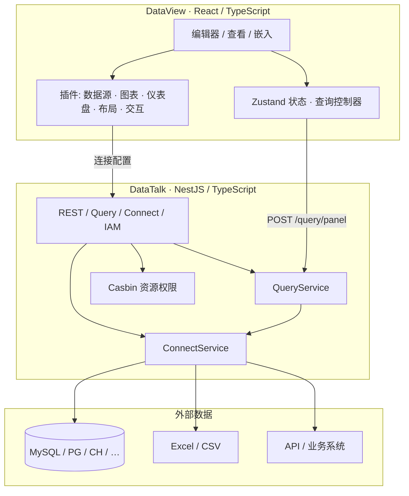
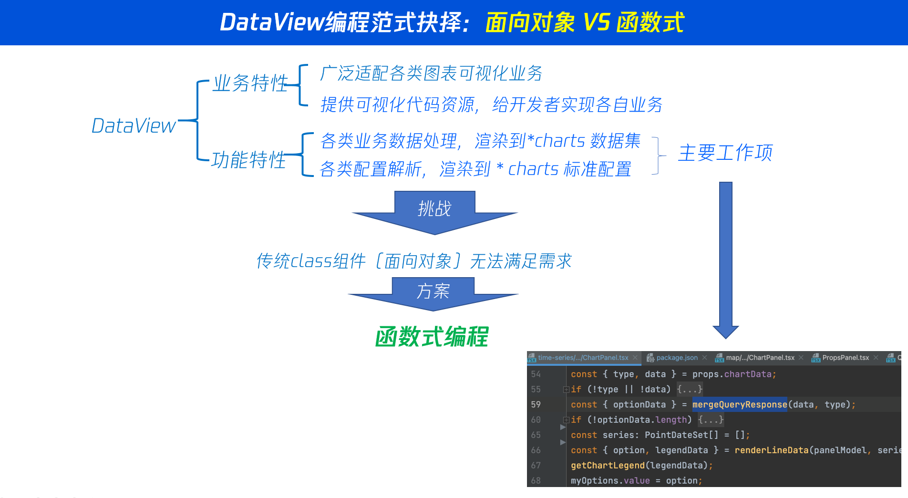
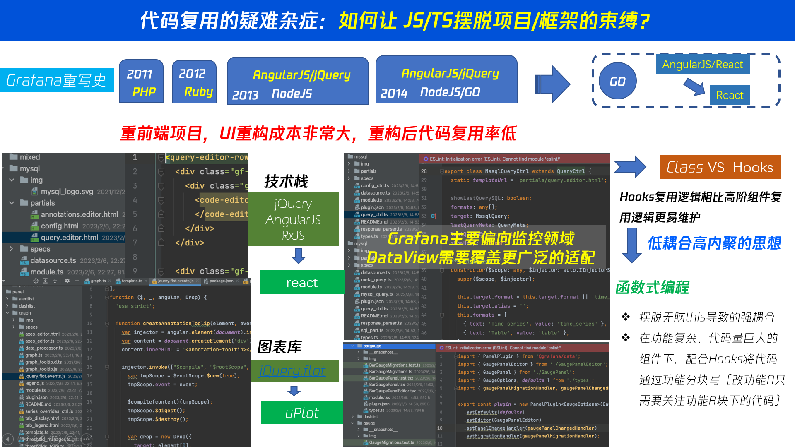
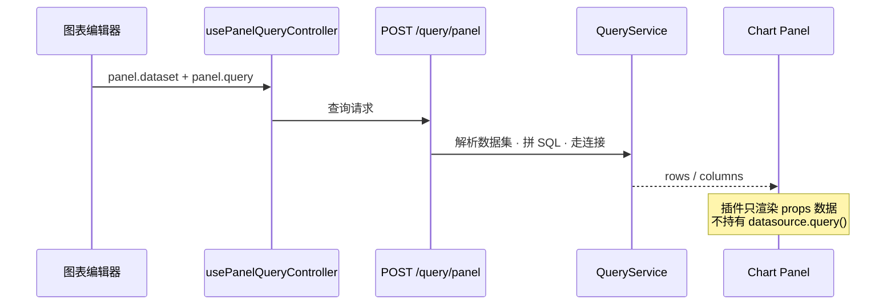

# 架构概览

DataLuminary 整个平台基于 **数据驱动**：数据源接入、数据集建模、图表渲染、仪表盘编排与权限协作共用同一套状态与契约，而不是靠页面事件互相抛接。

## 总体架构

平台拆为两层可独立演进的产品仓，由契约与 HTTP API 粘合：

| 层 | 仓库 | 职责 |
|----|------|------|
| **DataView** | 前端 SPA | 创作、可视化、插件 UI、嵌入只读页 |
| **DataTalk** | NestJS API | 连接、数据集、查询、权限、分享令牌、订阅渲染 |


```mermaid
flowchart TB
  subgraph Client["DataView · React / TypeScript"]
    UI[编辑器 / 查看 / 嵌入]
    PL[插件: 数据源 · 图表 · 仪表盘 · 布局 · 交互]
    ST[Zustand 状态 · 查询控制器]
    UI --> PL
    UI --> ST
  end

  subgraph Server["DataTalk · NestJS / TypeScript"]
    API[REST / Query / Connect / IAM]
    QS[QueryService]
    CS[ConnectService]
    ACL[Casbin 资源权限]
    API --> QS
    API --> CS
    API --> ACL
    QS --> CS
  end

  subgraph Data["外部数据"]
    DB[(MySQL / PG / CH / …)]
    FILE[Excel / CSV]
    EXT[API / 业务系统]
  end

  ST -->|POST /query/panel| QS
  PL -->|连接配置| API
  CS --> DB
  CS --> FILE
  CS --> EXT
```

数据主路径：

```text
数据源插件（只配连接）
    → 数据集（语义字段 / 指标）
    → 图表 query（绑定数据集，不直连库）
    → DataTalk QueryService
    → 图表 Panel 只消费返回数据做渲染
    → 仪表盘 / 布局插件编排整页
```

---

# 前端技术栈

## 函数式编程

因为技术数据驱动，我们采用函数式编程，减少副作用，提升代码的可维性。



考虑我们需要广泛适配业务，以及各个品台的组件嵌入与迁移，以为作为持久性项目。
我们采用最为通用 与维护成本最低的技术方案：整个项目采用typescript编写——性能问题由rust来解决。



## 全栈 TypeScript 的优势

DataLuminary **前后端与插件契约统一使用 TypeScript**（高性能热点可下沉 Rust / WASM，不改业务语言面）：

| 优势 | 说明 |
|------|------|
| **一套类型走通链路** | 数据集字段、Panel query、QueryService DTO、嵌入 JWT claim 可共用或镜像类型，减少「前端猜、后端另写」的漂移 |
| **插件与宿主同语言** | 图表 / 数据源 / 布局插件用 React + TS 编写，与编辑器壳同一工具链，二次开发门槛低 |
| **利于 AI 协作改代码** | Schema、接口、组件同属 TS，生成与审查成本低于 Python/Java 混栈 |
| **部署与运行时简单** | Node ≥ 24 一条链：开发、测试、私有化镜像语言面一致 |
| **性能可分层** | 常规 BI 走 TS；重计算 / 渲染热点用 Rust 或无头浏览器，不必整仓换语言 |

## React 技术栈

因为采用数据驱动，前端采用 React 技术栈：

- 单向数据流、严格的状态控制：更利于数据消费场景，追踪与溯源
- 函数式编程，减少副作用，提升代码的可维护性
- 生态系统及企业级工具链

作为数据图表分析平台，React 凭借严格的单向数据流、灵活的状态管理生态、高性能渲染控制，更适合对数据一致性、可维护性和扩展性要求极高的架构设计。

## 前端核心依赖（当前）

| 类别 | 选型 | 用途 |
|------|------|------|
| UI | Ant Design | 编辑器壳、表单、管理页 |
| 表单 | Formily | 复杂配置面板 |
| 状态 | Zustand | 插件注册表、编辑态、交互状态 |
| 图表 | AntV G2 / S2 等（插件内可选） | 可视化渲染，按图表插件自由选择 |
| 布局 | react-grid-layout 等 | 网格仪表盘；自由布局另有独立实现 |
| 构建 | Rsbuild | 开发与生产一致、兼容 Webpack 生态 |
| 质量 | Biome · ESLint · Husky | 格式、静态检查、提交门禁 |
| 身份 | oidc-client-ts / LuminaryWorks auth | 统一登录与企业 SSO |

### Rsbuild

我们选择 Rsbuild 不止因为其高性能，更看重其对 Webpack 的兼容性，以及相比 Vite，开发与生产环境的一致性。

---

## 图表与数据流（代码说明）

图表默认与 **数据集** 的数据进行渲染，**不可以**直连数据源配图。数据源插件只负责连接配置；查询统一走 DataTalk。


```mermaid
sequenceDiagram
  participant Ed as 图表编辑器
  participant Q as usePanelQueryController
  participant API as POST /query/panel
  participant QS as QueryService
  participant P as Chart Panel

  Ed->>Q: panel.dataset + panel.query
  Q->>API: 查询请求
  API->>QS: 解析数据集 · 拼 SQL · 走连接
  QS-->>P: rows / columns
  Note over P: 插件只渲染 props 数据<br/>不持有 datasource.query()
```

面板与数据源的职责边界：

```typescript
// 数据源插件：连接配置 UI → DataTalk /api/connect/*
// 不向图表直接供数

// 图表插件：definePanelPlugin({ Panel, Config })
// 宿主注入查询结果；Panel 只负责 options → 视图

// 仪表盘插件：grid | position | list —— 整页几何
// 布局插件：row | tab | swiper —— 页内分组嵌套
```

更细的插件契约见 [插件核心概念](/plugins/)；布局分层见 [仪表盘与布局插件](/product/dashboard-layout-plugins)。

---

# 后端技术栈

我们没有采用业界通用的 Python、Java、Go 等作为主业务语言，而是采用 **TypeScript**（必要时 **Rust / WASM**）。

> 原因：前后端一体化。例如折线图从数据到图表渲染的 dataset，可在 client 端渲染，降低服务端压力；也可后端渲染，提供 serverless / 订阅截图能力。  
> 对于高性能场景，采用 Rust / WASM 等方案。

后端侧重 **数据查询与连接管理**，基于事件驱动与非阻塞 I/O，符合 BI 查询场景；数据集侧的清洗、转换、聚合与前端创作体验衔接。

结合无头浏览器（订阅推送截图等）与可选 SSR，在后端渲染层面更好适配业务交付。

## 后端框架

- **NestJS** + Fastify：模块化 API、鉴权守卫、Swagger  
- **连接器**：mysql2 / pg / mssql 等（经 ConnectService）  
- **权限**：Casbin（资源 ACL，不塞进 IdP）  
- **ORM / 存储**：TypeORM · PostgreSQL（平台元数据）
