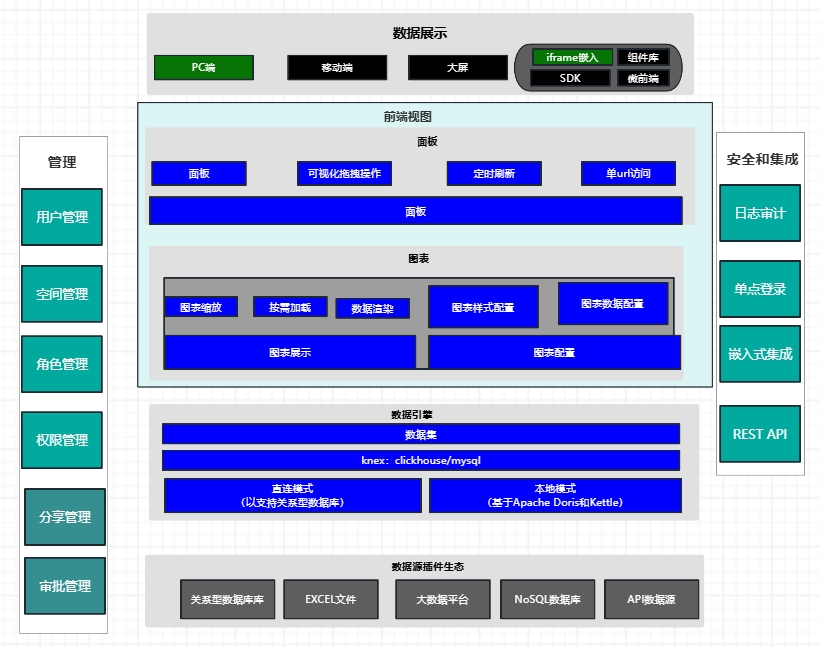
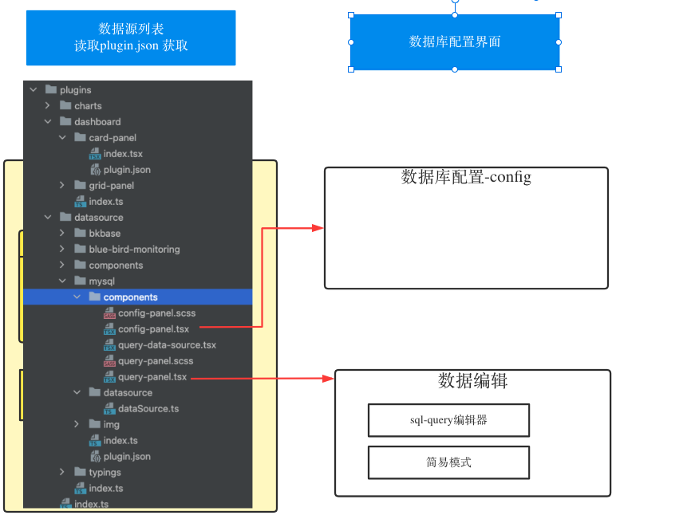

# 模型

DataLuminary 整个平台基于 数据驱动！
# 前端技术栈
## 函数式编程
因为技术数据驱动，我们采用函数式编程，减少副作用，提升代码的可维性。

考虑我们需要广泛适配业务，以及各个品台的组件嵌入与迁移，以为作为持久性项目。
我们采用最为通用 与维护成本最低的技术方案：整个项目采用typescript编写——性能问题由rust来解决。

## react技术栈
因为采用数据驱动，前端采用react技术栈：
+ 单向数据流、严格的状态控制：更利于数据消费场景，追踪与索源
+ 函数式编程，减少副作用，提升代码的可维性
+ 生态系统及企业级工具链
作为数据图表分析平台，React 凭借严格的单向数据流、灵活的状态管理生态、高性能渲染控制，更适合对数据一致性、可维护性和扩展性要求极高的架构设计。
### 项目基本库
+ 前端
    + 组件库：
    + UI:
      + antDesign
      + iconfont库：阿里iconfont
    + 打包工具：
      + rsbuild
    + 代码检查：
      + eslint
      + biome
      + husky
  + 状态管理
    + zustand
+ 图表库(插件化，自由选择)：echarts、antV、highcharts

### rsbuild
我们选择 rsbuild 不止因为其高性能，更看重其对webpack的兼容性，以及相比vite，开发与生产环境的一致性

## 图表渲染模型
图表默认与数据集的数据进行渲染，当然也可以直连数据源进行配图。

### 面板插件示意图

### 数据源插件说明

# 后端技术栈
我们没有采用业界通用的python、java、go等语言，而是采用typescript + rust。
> 原因： 前端后一体化。 比如折线图 从数据到图表渲染的dataset，我们在client端渲染，降低服务单压力。也可以后端渲染，提供serverless能力。
> 对于高性能场景，我们采用 rust/wasm等方案

我们采用typescript 的方案，我们有数据集，做我们做数据清洗、转换、聚合等功能。

而我们的后端，更多的是做数据查询与文件读写，基于事件驱动和非阻塞 I/O 符合我们的业务场景

同时结合Puppeteer、SSR，在后端渲染层面，能更好的适配业务开发！
## 后端框架
nestjs + knex

