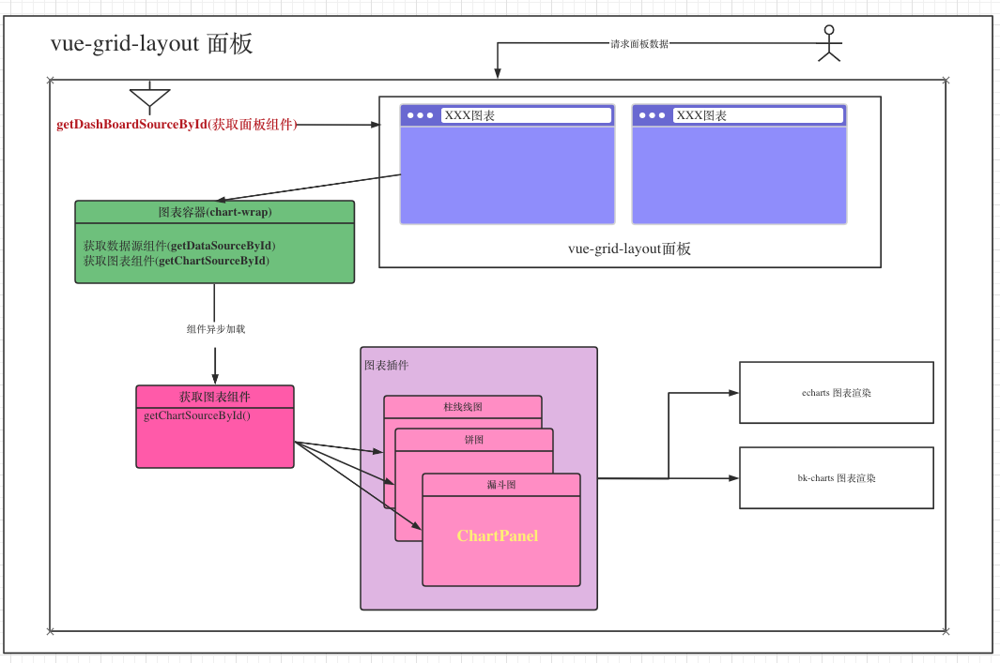

### 项目基本库
+ 组件库：https://magicbox.bk.tencent.com/static_api/v3/components_vue/2.0/example/index.html#/
+ iconfont库：
+ 打包工具：https://github.com/zhoulujun/bkui-cli

### 模型

### 整体架构图

### 数据源插件说明

### 面板插件示意图

### 图表渲染模型

