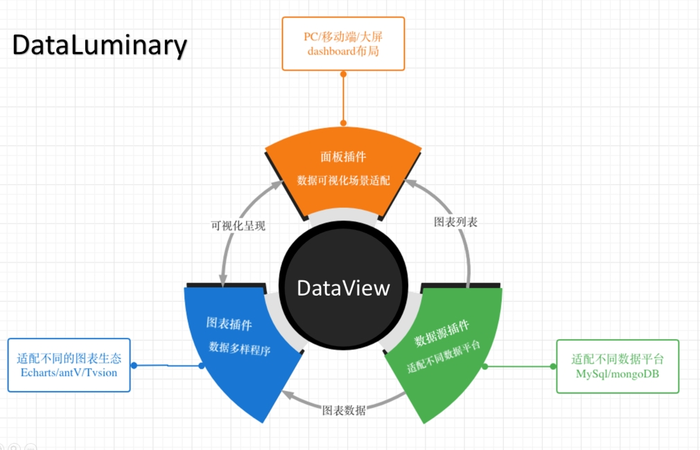

 # 设计理念
DataLuminary 为一个开放的LessCode数据处理平台，提供数据挖掘、分析、审核、报表的综合BI品台。
## LessCode
我们希望是非专业开发者也能够做数据分析，并输出洞察/审计报告/表等。

比如产品、运营、运维能够快速清洗数据，构建数据集，搭可视化页面（DataView的核心功能）
## 插件化
有别与传统的BI工具，DataLuminary是一个微内核的插件化架构
> 关于插件化，推荐阅读
+ [《插件化架构设计(1):插件化架构能解决什么问题？为啥选它？ 》](https://www.zhoulujun.cn/html/webfront/engineer/Architecture/8755.html)
+ [《插件化架构设计(2):插件化从设计到实践该考量的问题汇总  》](https://www.zhoulujun.cn/html/webfront/engineer/Architecture/8907.html)

面板、图表、数据集三大插件生态丰富DataLuminary的***一切可视化需求***！

同时，DataLuminary 还拥有强大的数据处理能。

通过数据源插件接入的各类数据，在DataLuminary 大数据集重进行处理。

我们提供各类场景模型，适配各类业务场景。

我们通过强约束的JSON Schema 、各类开发模板与脚手架，保证平台各个模块的连贯性。

## 数据集
数据集是DataLuminary的数据座舱。

通过数据源插件，实现多源数据整合：通过MySQL、MongoDB、Excel、API等数据源插件，融合结构化或非结构化数据。

我们提供数据清洗、数据转换、数据聚合等功能，帮助用户处理和分析数据。
> 通过拖拽的方式，PM、PO、BI、Developer 等能够快速清洗出 消费数据。
> 同时，我们也提供了数据审核功能，帮助用户确保数据的准确性和完整性。
> 基于平台的数据集，结合DeepSeek，让数据洞察未来！

## 数据驱动
我们没有采用事件驱动，而是采用数据驱动的方式。
> 在前端，从事件驱动到数据驱动，可以理解为从用户交互为中心，调整成以数据的状态扭转为中心，来进行一些页面逻辑的实现。
> 事件驱动的方式相比于数据驱动，少了数据抽象设计的一部分，因此开发的时候可能很快就完成某个功能的实现。但从维护和拓展的角度来说，习惯数据驱动的方式，在遇到功能变更和迭代时可以更高效、更合理地进行调整。
具体推荐阅读[《重要的编程模型对比：事件驱动/消息驱动/数据驱动》]( https://www.zhoulujun.cn/html/webfront/engineer/Architecture/9074.html)
> ***基于数据驱动，我们在编程实现的过程中，更多的是思考数据状态的维护和处理，而无需过于考虑 UI 的变化和事件的监听。***

