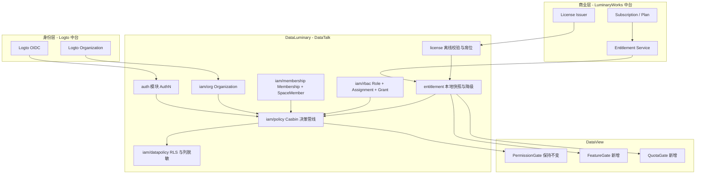
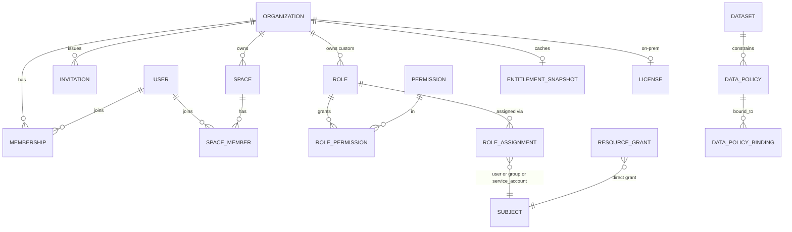
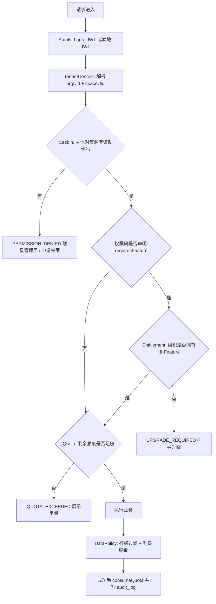

# 权限架构设计

> 面向架构、交付与深度产品读者。产品叙事见 [概念](./index.md)；契约权威源：MetaRepo `spec/contracts/iam-v2.md`、DataTalk `spec/development/iam-v2.md`。  
> 本文 §1–§3、§8 吸收 IAM v2 架构设计原文（总体架构 / 核心概念 / 数据模型 / 授权决策管线）。

## 1. 总体架构



职责边界：

- **Logto** 只管 AuthN 与组织身份，不承载业务 ACL。
- **中台** 只管「买了什么」，不知道「谁能操作哪张仪表盘」。
- **DataTalk** 只管「谁能操作什么」与「能看到哪些行哪些列」。

| 层 | 归属 | 职责 | 禁止 |
|----|------|------|------|
| AuthN | Logto / 企业 IdP | 身份、MFA、Organization 身份 | 不承载业务 ACL |
| AuthZ | DataTalk Casbin | 谁能操作哪张仪表盘 | ACL **不进** JWT |
| 商业能力 | 中台 Entitlement / License | Feature / Quota | 不替代 RBAC |

## 2. 核心概念

- **Organization**：租户，也是计费主体与身份边界，1:1 映射 Logto Organization。企业客户 = 一个 Organization；私有化部署 = 一个 License 对应一个 Organization。
- **Space**：项目 / 协作单元与 ACL 作用域，隶属于 Organization，是 Dashboard / Dataset / Datasource 的容器。
- **Tenant**：不作为独立实体，Tenant 即 Organization。三层合并为两层。
- **Membership**：`user × organization`，携带组织角色。
- **SpaceMember**：`user × space`，携带空间角色。
- **RoleAssignment**：统一的「主体 × 角色 × 作用域」授权，取代旧 `user_role`。
- **ResourceGrant**：「主体 × 具体资源 × 动作」直授，取代旧 `role_resource`，支撑分享与临时授权。
- **Entitlement**：组织买到的 Feature 开关与 Quota 额度，来自中台或 License。
- **DataPolicy**：数据集上的行级过滤与列级脱敏规则（模型已落地，查询链路执法后置）。

空间隔离规则：

- 无 Space 访问权 → 其下 dashboard / panel / dataset 等一律不可见。
- 无 Dashboard 访问权 → 其下 Panel 不可访问（含直链）。

## 3. 数据模型

### 3.1 ER



### 3.2 核心表（摘要）

| 表 | 要点 |
|----|------|
| `organization` | `uid, name, slug, type, logto_org_id, status, owner_user_id` |
| `membership` | `org_id × user_id` 唯一；`status` / `source(manual\|sso\|scim\|invite)` |
| `space_member` | `space_id × user_id` 唯一 |
| `invitation` | 邮箱邀请、token、过期与状态机 |
| `role_assignment` | `subject × role × scope_level × scope_id`（取代 `user_role`） |
| `resource_grant` | 资源直授 + `allow\|deny`（取代 `role_resource`） |
| `audit_log` | 组织 / 平台操作审计 |
| `entitlement_snapshot` / `license` | 权益快照与私有化许可 |
| `data_policy` (+ binding) | 行 / 列策略（查询执法后置） |

改造要点：`space.org_id` 非空；`logto_org_id` 迁至组织表；`role` 增加 `scope_level` / `builtin` / `org_id`；删除旧 `user_role` / `role_resource`。

### 3.3 内置角色

| scope | codes |
|-------|-------|
| platform | `platform_admin`, `it_support` |
| org | `org_owner`, `org_admin`, `org_billing`, `org_member`, `org_guest` |
| space | `space_owner`, `space_admin`, `space_editor`, `space_viewer` |

自定义角色：`role.org_id` + `scope_level`；内置角色不可改权限集、不可删。

### 3.4 `/auth/me` 上下文

- Query：`?orgUid=&spaceUid=`；Header：`X-Org-Uid` / `X-Space-Uid`
- `permissions` = platform ∪ org ∪ space（有 `spaceUid` 时）有效权限码并集
- 既有字段 `user` / `permissions` / `roles` / `resourcePermissions` **只做加法**；可选 `context` / `organizations` / `entitlements` / `edition`

## 4. 权限模型

### 4.1 权限码

- 格式：`resource:action`（如 `dashboard:edit`、`space:view`）。
- Feature **不得**写入 `permission` 表；通过权限定义上的 `requiresFeature` 声明与商业能力关联。

### 4.2 内置角色

| scope | codes |
|-------|-------|
| platform | `platform_admin`, `it_support` |
| org | `org_owner`, `org_admin`, `org_billing`, `org_member`, `org_guest` |
| space | `space_owner`, `space_admin`, `space_editor`, `space_viewer` |

组织可创建自定义角色；`builtin` 角色不可改权限集、不可删。

### 4.3 Casbin

```ini
r = sub, dom, obj, act
p = sub, dom, obj, act, eft
g = _, _, _
g2 = _, _
e = !some(where (p.eft == deny)) && some(where (p.eft == allow))
m = g(r.sub, p.sub, p.dom) && g2(r.dom, p.dom) && keyMatch(r.obj, p.obj) && (r.act == p.act || p.act == "*")
```

- 模型含 **domain**（组织 / 空间作用域）。
- 空 scope **默认拒绝**（禁止旧版「全量放行」）。
- 资源列表/详情仍返回 `{ view, create, edit, delete, … }` 布尔图，由 `PermissionService.attachPermissions` 产出。

### 4.4 外部角色映射

IdP JWT 中的角色 claim（默认 `roles`）经 `external_role_mapping` 映射为本地角色，在 SSO 登录时写入。平台超管通常由 Identity 侧 `super_admin` / `platform_admin` 映射而来。

## 5. Subscription 模型

Subscription 描述组织与套餐的**商业关系**（谁买了什么计划、席位、有效期）。产品侧不把订阅明细塞进 JWT。

| 形态 | 订阅如何进入产品 |
|------|------------------|
| SaaS | 中央会员 / 中台维护订阅 → 同步为组织 Entitlement 快照 |
| 私有化 | 合同交付 License（见 §7），本地呈现 edition / seats |

组织管理员可在计费视图查看 `edition`、席位用量与当前 Feature / Quota（`GET /org/:orgUid/billing`）。

## 6. Entitlement 模型

Entitlement 是决策管线中的**商业能力层**：Feature 开关 + Quota 用量。

### 6.1 典型 Feature / Quota

| Code | 含义（示例） |
|------|----------------|
| `ai.analysis` | 高级 / AI 分析 |
| `dashboard.export` | 导出 / PDF |
| `dashboard.share` | 创建分享 |
| `dashboard.count` | 看板数量配额 |
| `storage.bytes` | 存储配额 |

### 6.2 模式（`ENTITLEMENT_MODE`）

| 模式 | 行为 |
|------|------|
| `off` | 不调用中央；本地默认放行（可逆） |
| `shadow_read` | 双读；本地仍生效；记录差异 |
| `enforce` | 中央权威；不确定时 fail closed |

### 6.3 解析器

`EntitlementResolver` 策略：

- **CentralEntitlementResolver**：`DEPLOY_MODE` 偏 SaaS / 中台可达时，拉取中央快照。
- **LicenseEntitlementResolver**：私有化用已上传 License 注入 Feature / Quota。

Subject = 认证用户的 Logto `sub` / `external_id`（或 `local:{uid}`），**从不**取自 request body。License / Entitlement **不**设置 `casbinBypass`。

## 7. License 模型

私有化与气隙场景下，License 是签名的商业权益包：

- 上传：`POST /api/org/:orgUid/license`，body `{ jws: string }`。
- 验签公钥：`ENTITLEMENT_LICENSE_PUBLIC_KEYS` 等环境变量。
- 绑定：1 License ↔ 1 Organization。
- 状态：`active` / `expired` / `revoked` / `grace`（宽限只读等由服务解释）。
- 审计：`org.license.upload`。

License **只**注入商业 Feature / Quota，**不能**绕过 Casbin 资源 ACL。

## 8. 授权决策管线

权威顺序（与契约一致；**有意**把 RBAC 放在 Entitlement 之前）：

```text
AuthN → TenantContext → Casbin(RBAC) → Entitlement(Feature) → Quota → 业务 → DataPolicy → audit
```

理由：绝不向无资源访问权的主体披露组织商业状态（避免「没权限却先被推销升级」）。



管线由单一 `AccessDecisionService.decide(ctx)` 实现，Guard 只是薄封装；禁止在 controller 里散落判断。

### 错误契约（摘要）

统一 envelope（详见 `spec/contracts/access-error.md`）：

```ts
interface AccessDeniedPayload {
  reason:
    | "PERMISSION_DENIED"
    | "UPGRADE_REQUIRED"
    | "QUOTA_EXCEEDED"
    | "SEAT_LIMIT_REACHED"
    | "LICENSE_INVALID"
    | "LICENSE_EXPIRED"
    | "ORG_SUSPENDED";
  message: string;
  detail?: {
    resource?: string;
    action?: string;
    feature?: string;
    requiredPlan?: string;
    quota?: { key: string; limit: number; used: number; resetAt?: string };
    applyUrl?: string;
    upgradeUrl?: string;
  };
}
```

前端 `AccessGate` 拒绝优先级与后端一致：**Permission → Upgrade(Feature) → Quota**；既有 499 / 申请权限通路按 `reason` 扩展，不替换。

## 9. 前端 Guard 设计

DataView `src/components/permission/`：

| 组件 | 职责 | 数据来源 |
|------|------|----------|
| **PermissionGate** | 资源布尔权限 / 动作灰置 | API 行上 `permissions` + 角色 |
| **FeatureGate** | 商业功能未购买时锁定 | `entitlement` store `hasFeature` |
| **QuotaGate** | 配额用尽时锁定 | `entitlement` store `used/limit` |
| **AccessGate** | 组合门闸；拒绝原因 `permission` \| `upgrade` \| `quota` | 上述三者 |

行为约定：

- 默认用 `LockedAction` 灰置 + tooltip，而不是静默隐藏（便于区分「无权限」与「需升级」）。
- 现有 `RequirePermission` / `PermissionGate` 调用点在 IAM v2 加法契约下**无需修改**即可工作。
- AuthN 壳层（`RequireAuth` / AuthGate）只负责登录态，不判资源 ACL。

## 10. 后端 Service 设计

模块布局（DataTalk）：

```text
modules/
  auth/                 # AuthN；/auth/me 字段加法
  iam/
    org/ membership/ rbac/ policy/ datapolicy/ audit/
  entitlement/          # EntitlementResolver 策略
  license/
  platform-admin/
```

| 服务 | 职责 |
|------|------|
| **AccessDecisionService** | 决策管线 `RBAC → Feature → Quota`；错误体对齐 `AccessDeniedPayload` |
| **PermissionService / Casbin** | domain 维 enforce、权限码检查、`attachPermissions` |
| **EntitlementResolver** | `snapshot` / `checkFeature` / `checkQuota` / `consumeQuota` |
| **LicenseService** | JWS 校验、落库、席位统计、宽限只读 |
| **PlatformAdminGuard** | 平台角色门闸（组织开通、跨空间嵌入应用搜索等） |

Guard 仅为薄封装；业务服务应通过 `AccessDecisionService.assertAllowed`（或等价）统一拒绝语义。

## 11. 数据库 Schema

### 11.1 表清单（IAM v2 核心）

| 表 | 用途 |
|----|------|
| `organization` | 组织 / 租户 |
| `membership` | 用户 ↔ 组织 |
| `space_member` | 用户 ↔ 空间 |
| `invitation` | 组织邀请 |
| `role` | 角色（含 `scope_level` / `builtin` / `org_id`） |
| `permission` | 权限码目录 |
| `role_permission` | 角色 ↔ 权限码 |
| `role_assignment` | 主体 ↔ 角色 ↔ scope（取代 `user_role`） |
| `resource_grant` | 资源直授（取代 `role_resource`） |
| `external_role_mapping` | IdP 角色 → 本地角色 |
| `audit_log` | 组织 / 平台审计 |
| `entitlement_snapshot` | 权益快照 |
| `license` | 私有化许可 |
| `data_policy` / `data_policy_binding` | 行/列策略（查询执法后置） |
| `external_application` / `embed_token` / `embed_audit_event` | 第三方嵌入 |
| `dashboard_share` 等 | 分享可见范围与审核 |

改造要点：`space.org_id` 非空；删除 `space.logto_org_id` 一类旧字段；Casbin 策略由上述 ACL 表加载。

### 11.2 关系图

见上文 [§3.1 ER](#31-er)。嵌入应用 / 分享等扩展表见 §11.1 清单。

---

## 相关文档

- [概念](./index.md) · [FAQ](./faq.md)
- [统一身份与企业 SSO](../product/unified-identity.md)
- [私有化对接](../develop/iam-private-deploy.md) · [企业 SSO](../develop/iam-enterprise-sso.md) · [嵌入对接](../develop/embed-integration.md)
- 工程契约：`spec/contracts/iam-v2.md` · `spec/contracts/access-error.md`
- 工程路线图索引：`plan/iam-v2-roadmap.md`
- 历史选型摘录见 [PERMISSION_ARCHITECTURE.md](./PERMISSION_ARCHITECTURE.md)（已归档，勿作权威）
