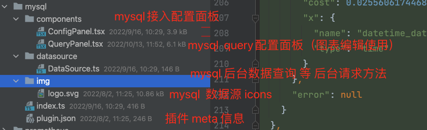

## 数据源插件
DataLuminary支持不同的数据源（如mysql数据库、API接口、excel等） 作为图表数据源来源。

**作用**：根据不同的数据源，显示相应的数据源配置，及查询条件

不同的数据源类型接入DataLuminary 配置不同，数据源查询方法不同。

所以，一个数据源插件至少包含2个面板：
+ 数据源配置面板组件（ConfigPanel)
+ 数据查询配置面板组件（QueryPanel)

下面以mysql 数据源为案例 讲解msyql 数据源开发：


### 以mysql数据源插件
以mysql 数据源为例：


比如说：选择MySQL数据源 则会展示 user,host,password,timezone等这些数据源配置 以及 select,where,group,order,limit 等这些查询条件 数据源插件结构


```
| -- plugins
  |-- datasource 数据源插件
    |-- index.ts entry
    |-- mysql msyql数据源插件
      |-- plugin.json  mysql数据源 元数据 信息
      |-- index.ts 插件入口
      |-- datasource 数据处理类
        |-- DataSource.ts  mysql数据源query查询、配置验证等方法
      |-- components 
        |-- QueryPanel.tsx 数据查询组件(配置 mysql 查询query 面板）
        |-- ConfigPanel.tsx 数据源配置组件（ 项目配置/修改 mysql 面板）
      |-- img
        |-- logo.svg          
```

query-panel.tsx、config-panel.tsx 为基础的表单组件，每个数据源的表单都不一样，根据具体情形开发。

+ ConfigPanel.tsx 保存数据源配置
+ QueryPanel.tsx 保存图表的query 信息，保存在图表的query信息中

```typescript
export interface IPanelModel<Datasource = DatasourceMysql,
  Query = QueryMysql,
  ChartConfig = ChartConfigForm> extends IPanelModelBase {
  // 图表数据源
  datasource: Datasource;
  // 图表数据源的query配置
  query: Query[];
  id: string | number;
  space_id?: string | number
}
```
### 实现简释
#### datasource.ts 实现

```typescript
export default class DataSource extends BaseDataSource {
// TODO  方法重载
}
```

datasource基础类型

````typescript
export abstract class BaseDataSource {
  name: string;
  id: string;
  type: string;
  configData: Record<string, any>;

  constructor(dataSourceOption: DataSourceOption<Record<string, any>>) {
    this.name = dataSourceOption.name;
    this.id = dataSourceOption.id;
    this.type = dataSourceOption.type;
    this.configData = dataSourceOption;
  }

  /**
   * @description: 数据查询
   * @queryData
   * @return {*}
   */
  async query?(queryData: DataQueryRequest<QueryMysql>): Promise<QueryPointsResponse> {
    return querySpecifiedData(queryData);
  };

  /**
   * @description:变量数据查询
   * @param {*} 查询参数
   * @return {*}
   */
  variableQuery?(): Promise<VariableQueryResponse>;

  // 测试datasource config配置是否生效
  testConfig?(): Promise<ITestConfigResponse> {
    console.info('测试datasource插件');
    return new Promise((resolve) => {
      resolve({
        message: '测试datasource插件成功',
        status: 'success',
      });
    });
  };
}
````

图表组件通过调用 BaseDataSource.query 方法，获取数据

```typescript

const queryData = async () => {
  this.loading = true;
  this.errorMsg = '';
  const {datasource, query} = this.panel;
  const {type, uid} = datasource;
  const {DataSource} = await getDataSourceById(type);
  const datasourceInstance = new DataSource(datasource);
  const [from, to] = DashboardModule.getTimeRange;
  console.info('图表查询是图标数据______');
  // console.log(this.panel.title, !Array.isArray(query) || !query.length);
  if (!Array.isArray(query) || !query.length) {
    this.loading = false;
    return;
  }
  // 图表查询请求数据组装
  const parmas: DataQueryRequest<QueryMysql> = {
    queries,
    option: {
      range: {
        from,
        to,
      },
      variables: {},
    },
  };
  // 查询图表数据
  datasourceInstance.query(parmas)
    .then((res: QueryPointsResponse) => {
      this.calChartData(res);
      this.loading = false;
    })
}
```

#### query 接口说明
 以返回point 格式为例：
##### 入参说明

```
{
        queries,
        option: {
            range: {
                from,
                to,
            },
            variables: {},
        },
}
```

必备参数

```typescript
const a = {
  "queries": [
    {
      "x": { // 时间轴
        "name": "datetime_datetime",
        "type": "time"
      },
      "format": "point", // 返回数据格式 
      "ref_id": "A", // query 名称
      "datasource": { // 数据源
        "type": "mysql",
        "uid": "JHtUr9NnUKvZuA7t8frYwG"
      },
    }
  ],
  "option": { // 查询条件
    "range": {
      "from": 1646830459171,
      "to": 1646834059171
    },
    "variables": {} // 变量配置
  }
}

```

##### 返回数据结构
首先参考：  [图表接口说明](../api/Charts)

一般 时序图返回 `point`格式，其他的默认返回`row` 格式

以`row` 数据集为例：
```typescript
const a = {
  "result": true,
  "data": {
    "A": { // query A 数据
      "dataset": [ // 数据集
        {
          "name": "count_int",
          "data": []
        }
      ],
      "columns": [
        {
          "name": "datetime_datetime",
          "friendly_name": "datetime_datetime",
          "type": "datetime"
        }
      ],
      "meta": {
        "query_text": "SELECT\n datetime_datetime,\n count_int\nFROM home_testlinedata\nLIMIT 30 ",
        "cost": 0.025560617446899414,
        "x": {
          "name": "datetime_datetime",
          "type": "time"
        }
      },
      "error": null
    }
  },
  "code": 200,
  "message": ""
}
```

#### ConfigPanle.tsx说明

datasource配置说明
##### 数据源基本配置
```typescript
/**
 * 数据源公共配置接口
 */
export interface CommonDataSourceConfig {
  name: string;
  url: string;
  database: string;
  user: string;
  password: string;
  build_in: boolean;
  json_data?: {
    [props: string]: any;
  };
}


```

##### mysql数据源配置接口
```typescript
export interface MysqlDataSourceConfig {
  access: string;
  basicAuth?: boolean;
  basicAuthPassword?: string;
  basicAuthUser?: string;
  database?: string;
  uid: string;
  isDefault: boolean;
  build_in: boolean;
  json_data:
  | {
    timezone: string;
    maxOpenConns: number;
    maxIdleConns: number;
    connMaxLifetime: number;
    timeInterval: string;
    tlsAuth: boolean; // tls客戶端验证
    tlsAuthWithCACert: boolean; // 携带CA
    tlsSkipVerify: boolean; // 跳过tls验证
  }
  | {};
  name: string;
  orgId: string | number;
  password?: string;
  readOnly: boolean;
  secureJsonFields:
  | {
    // TLS/SSL Auth Details
    tlsCACert: string;
    tlsClientCert: string;
    tlsClientKey: string;
  }
  | {};
  type: string;
  typeName: string;
  typeLogoUrl: string;
  url?: string;
  user?: string;
  version: number;
  withCredentials?: boolean;
}
```

