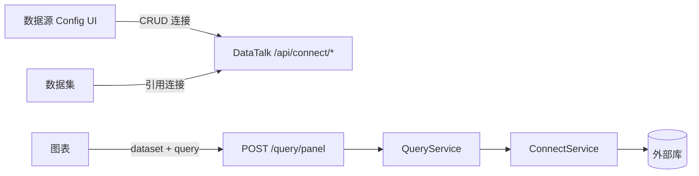

# 数据源插件

数据源插件负责把外部存储 **接入平台**：展示连接配置、测试连通性，并把凭据交给 DataTalk。

**关键边界**：图表 **不** 通过数据源插件实例直接 `query()`。配图数据一律来自 **数据集 + QueryService**。数据源插件在数据集建模、连接管理场景使用。

## 内置类型

| kind | 说明 |
|------|------|
| `mysql` | MySQL |
| `postgresql` | PostgreSQL |
| `sql-server` | SQL Server |
| `click-house` | ClickHouse |
| `excel` | Excel / 表格文件 |

## 插件组成

一个数据源插件至少包含：

- **配置面板**：主机、库名、账号、TLS 等（保存到连接资源）  
- **（可选）高级表单**：连接池、时区等  
- **meta / package.json**：`mode: "datasource"`、`kind`、名称与 logo  

查询编辑器若存在，用于 **数据集 / 连接预览**，不是 Grafana 式「图表直连 QueryEditor」。

## 目录示例

```text
DataView/src/plugins/datasource/mysql/
  index.ts              # 导出插件模块
  package.json          # kind / mode / 元信息
  components/           # Config / Form UI
  img/logo.svg
```

## 与后端的关系


```mermaid
flowchart LR
  UI[数据源 Config UI] -->|CRUD 连接| API["DataTalk /api/connect/*"]
  SET[数据集] -->|引用连接| API
  CH[图表] -->|dataset + query| Q["POST /query/panel"]
  Q --> QS[QueryService]
  QS --> CS[ConnectService]
  CS --> DB[(外部库)]
```

- 前端插件：表单与校验体验。  
- DataTalk `ConnectService`：真实驱动与连接池。  
- `QueryService`：按数据集解析 SQL / 参数并执行。

## 开发注意

1. 不要在图表插件里 `new DataSource(...).query()`——该路径已废弃。  
2. 连接密钥只存服务端；UI 不回显明文。  
3. 新增数据库类型时：同时补 DataView 配置 UI 与 DataTalk 连接器。  
4. 工程细节见 DataView `spec/development/datasource-plugins.md`。
