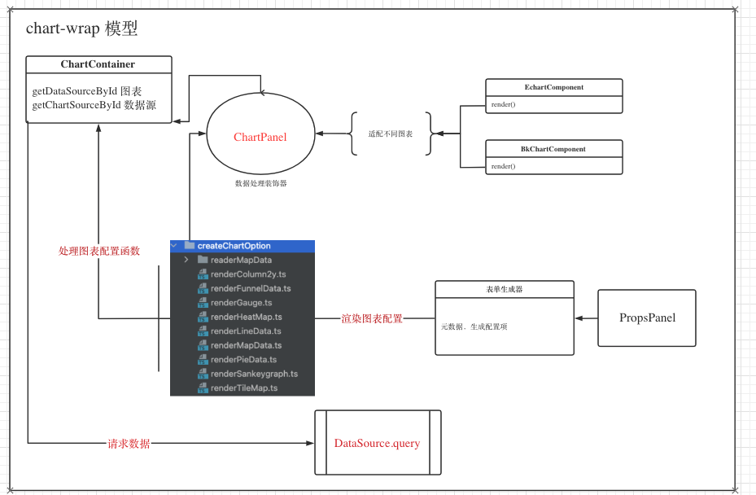

## 插件开发说明

## 插件说明

本项目 目前拥有三类插件：
+ [数据源插件](./datasource.md)
+ [图表插件](./panel.md)
+ [面板插件](./dashboard.md)

## DataLuminary插件生态
DataLuminary 作为一个图表开放平台，旗下有三大生态：
+ 图表插件，负责以**以特定的图表形势**展现数据。
  
  每个图表插件包含如下三个部分（以时序图为例）：
  + ChartPanel 图表渲染组件，渲染图表
  + PropsPanel 图表被配置组件，用户用户配置图表
  + meta 图表元数据，图表的信息描述
+ 数据源插件 ，负责对接图表与用户的数据

  每个数据源插件包含如下三个部分（以mysql数据源为例）
  + ConfigPanel  数据源配置组件
  + QueryPanel   数据查询配置组件
  + DataSource   数据查询类，包含如下三个基本方法
    + query() 数据查询
    + variableQuery() 变量查询
    + testDatasource() 数据源测试
    + postResource() 提交数据源
+ 面板插件，负责多个图表展示的面板布局。如grafana的dashboard面板、dataV的大屏面板等，可由不同的面板插件负责渲染。
  每个面板插件包含如下三个部分（以mysql数据源为例
  + ChartPanel 图表渲染组件，渲染图表
  + PropsPanel 图表被配置组件，用户用户配置图表
  + meta 图表元数据，图表的信息描述

DataLuminary 作为中台，分别提供三大插件集的适配规范。开放生态让用户自由定制整个平台的开发。


由数据源插件负责数据处理。提供query方法，让图表插件使用。图表插件即可单独分析，也可以有面板聚合成可视化页面 进行分析。

## DataLuminary 结构说明
DataLuminary 插件分为内置插件和外置插件（由build_in 字段决定）
```json
{
  "type": "mysql",
  "name": "MySQL",
  "id": "mysql",
  "build_in": true,
  "info": {
    "description": "Data source for MySQL databases",
    "author": "liangling",
    "logo": "img/logo.svg"
  }
}
```
内置插件存在在项目 ***src/plugins*** 目录，分别为
```
|-- src 项目源码
  |-- plugins 插件
  |-- charts 图表插件
    |-- index.ts entry
    |-- time-series 时序图插件
      |-- plugin.json 时序图meta信息
      |-- index.ts 插件入口
      |-- components 
        |-- chart-panel.tsx 图表插件
        |-- props-panel.tsx 图表配置插件
    |………………others
  |-- datasource 数据源插件
    |-- index.ts entry
    |-- mysql msyql数据源插件
      |-- plugin.json 时序图meta信息
      |-- index.ts 插件入口
      |-- datasource 数据处理类
        |-- dataSource.ts 
      |-- components 
        |-- query-panel.tsx 数据查询组件
        |-- config-panel.tsx 数据源配置组件
   |………………others
  |-- dashboard 面板插件
    |-- index.ts entry
    |-- card-panel 卡片图插件
      |-- plugin.json 时序图meta信息
      |-- index.ts 插件入口
```
外置插件插件 由用户自定义开发，提供插件远程加载路径，系统通过[system.js](url:https://github.com/systemjs/systemjs) 加载（SystemJS.import(path)）。


官方插件模板，其目录结构与内置插件结构类似
+ 数据源插件模板：
+ 图表插件模板：


## 插件加载机制
三类插件分别由 
+ chartSourcePluginLoad
+ dashBoardSourcePluginLoad
+ dataSourcePluginLoad 

加载
```typescript
import { 
  chartSourcePluginLoad, 
  dashBoardSourcePluginLoad, 
  dataSourcePluginLoad } from '@/common/systemjs-import';
```
### 原理概述
 如果为内置插件，会在
```typescript
import { ChartSourceModule } from '@store/chartsource';
import { DataSourceModule } from '@store/datasource';
import { DashBoardSourceModule } from '@store/dashBoardSource';
```
三个模块里面查找,非内置插件，则通过systemJS加载。

## 插件缓存
 加载好的插件存在在 vuex store内，避免重复加载
```typescript
import { ChartSourceModule } from '@store/chartsource';
import { DataSourceModule } from '@store/datasource';
```
## 插件使用
在 ***src/utils/dashboard.ts*** 提供插件加载方法
```typescript
import {
  getChartSourceById, 
  getDataSourceById,
  getDashBoardSourceById } from '@/utils/dashboard';
```
### 图表插件使用范例
如加载时序图插件
```typescript
 const type = 'time-series';
 const {
   ChartPanel,// 图表插件组件
   PropsPanel,// 图表配置插件组件
   meta, // 插件元信息
 } = await getChartSourceById(type);
```
根据所需配置加载不同的配置页

#### 详细说明
当需要展示插件时，会传递一个对象，至少有三个字段
  + type: string 所需要加载的插件类型
  + build_in: boolean 是否是本地的 true（是）
  + moudle: string 远程插件的加载路径
##### 具体流程


#### 图表渲染模型

#### 面板插件 如何渲染图表

### 数据源插件使用范例
加载mysql数据源插件
```typescript
const {
  ConfigPanel, // 数据源配置组件
  QueryPanel, // 数据源查询组件
  DataSource, // 数据源api 方法
  meta,
} = await getDataSourceById(type);
```
具体示例，请参考 ***src/components/chart-wrap/chart-wrapper.tsx*** 组件
### 数据源插件说明

