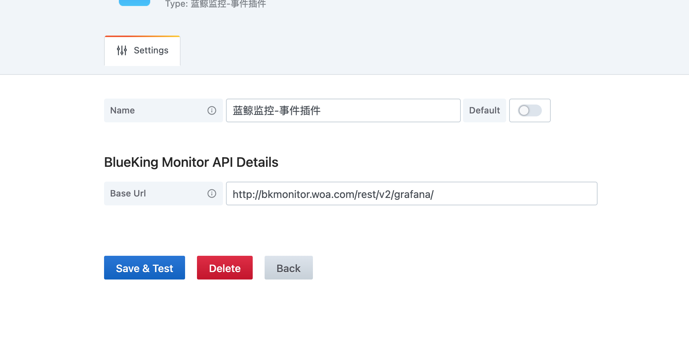
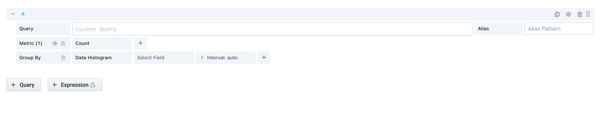
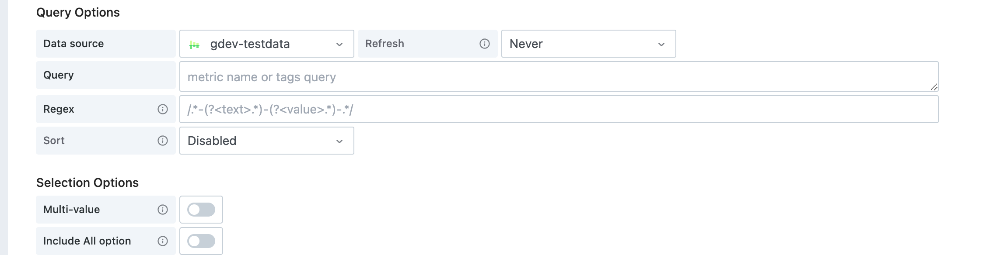
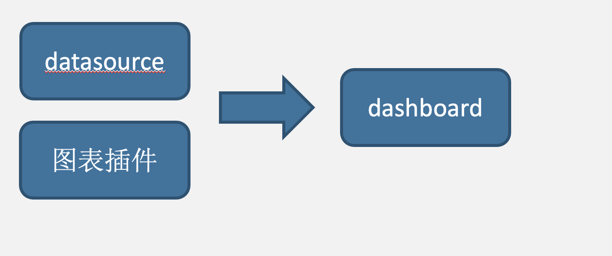
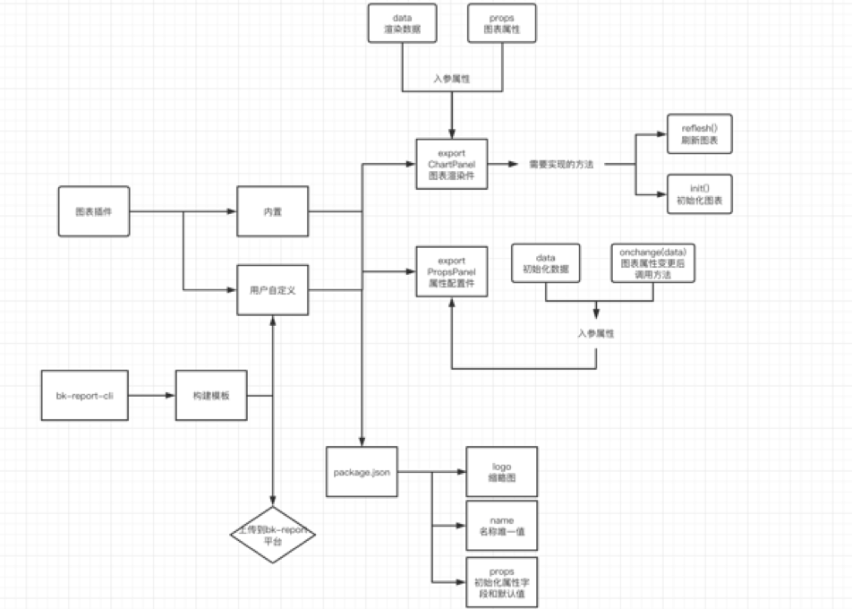
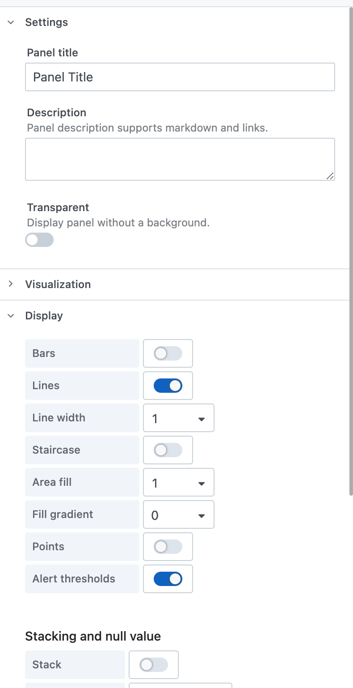
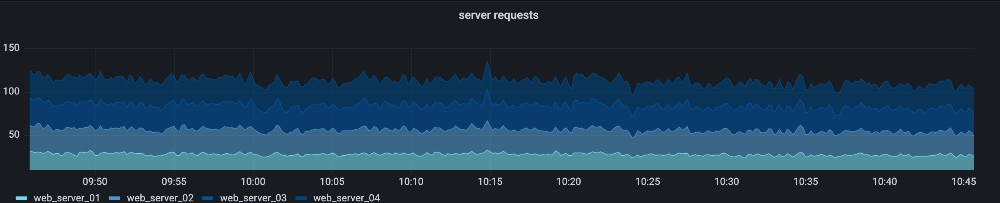

## 核心概念及定义

### 面板定义
面板是一个视图（比如多个图表、富文本）的集合定义。

每一个dashboard包含多个标签(BookMark)，每一个标签都是一个视图集合定义。

这里的标签我们可以等价于grafana平台上的dashboard，当然默认是单标签。
>BookMark 功能本身也是通过 Dashboard 类型插件实现

### 面板插件
dashboard 由面板插件生成，内置有：
+ grid-panel（网格视图）,基于`react-gird-layout`，可以导入grafana面板
+ position-panel(位置视图)，基于`tmagic-editor`适合大屏场景
+ card-panel(卡片视图)，适合报表、邮件、看板等场景
+ list-panel(列表视图)，适合移动端场景
具体参看：[面板插件](/plugin/dashboard.md)

### datasource 数据源插件

数据源插件负责数据源的接入，同时提供基础的数据查询功能
> 注意，图表消费的数据，我们默认由数据集集提供。 比如mysql 插件主要负责mysql接入平台，其Query模块负责在数据集中查看原始数据。

* ConfigPanel用于配置数据源基础信息配置。 即数据源插件初始化时的配置 与grafana ConfigEditor一致

  

* QueryPanel用于配置数据查询。 相当于grafana QueryEditor 用于数据查询配置

  

* VariablePanel用于配置变量查询。相当于grafana VariableQueryEditor 

  

* **开发注意**
  * datasource数据源插件的设计 基本上是参考了grafana数据源插件的设计模式 所以开发的时候可以参考一下grafana的实现方式
  * 数据源只负责数据的配置和查询 所以datasource 需要实现不同的特定名称的方法来做到不同的数据查询定义 这里也与grafana的设计一致
  * 数据的传导到图表展示也是通过平台来做中介
  * 每个panel都会在渲染实例化时 传入特定的方法和datasource实例来供panel内调用

具体参看：[数据源插件](/plugin/datasource.md)
### 图表定义
不同于 grafana、DataEase、DataTalk等平台：

视图层（如图表）由 ChartPanel的信息直连Datasource。

我们的配图插件仅负责渲染数据和属性配置，图表的数据均由数据集（数据湖）提供

具体参看：[图表插件](../plugin/panel.md)

### Panel 图表插件

* PropsPanel 属性配置面板  用于图表属性配置

  

* ChartPanel 图表面板 用于数据展示

  

* **开发注意**

  * 图表插件只负责数据的渲染和图表属性的配置 数据的获取都是同数据源来处理

  * 图表插件内的属性配置后的信息都是通过平台来进行传导 panel与panel之间不需要交互
  * 具体的开发设计细节查看上面的设计图
  * dashboard中所有的展示都应该由图表插件来完成  图表插件可以是一个文、地图、一条线等等 没有具体的形式

### 内置图表类型
[图表类型说明](../plugin/panelTypes.md)
