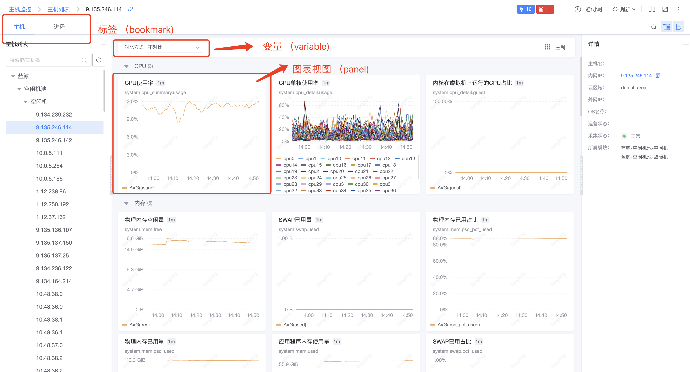

##### 视图平台通用插件设计

#### 面板定义

> 每一个dashboard包含多个标签(boookMark)，每一个标签都是一个视图集合定义。这里的标签我们可以等价于grafana平台上的dashboard，我们第一期不支持多个标签的话可以设计成单标签

dashboard 有面板插件生成，内置有 grid-panel(grafana dashboard)、card-panel(卡片视图)

#### 图表定义

> 每一个图表对应一个数据源插件（datasource) 和 一个图表插件（chartsource)组成 datasource负责图表展示的数据查询和定义。而图表插件负责图表的展示和属性配置

#### datasource 数据源插件

> 数据源插件 定义为处理数据查询有关的插件 所有图表的数据获取和定义都是通过数据源插件来完成 

* DataSource用于数据查询，是一个class  初始化的时候会在平台内实例化  实例化后在渲染各个其他panel时候 以属性的方式传入panel上

* ConfigPanel用于配置数据源基础信息配置。 即数据源插件初始化时的配置 与grafana ConfigEditor一致

  

* QueryPanel用于配置数据查询。 相当于grafana QueryEditor 用于数据查询配置

  

* VariablePanel用于配置变量查询。相当于grafana VariableQueryEditor 

  

* **开发注意**
  * datasource数据源插件的设计 基本上是参考了grafana数据源插件的设计模式 所以开发的时候可以参考一下grafana的实现方式
  * 数据源只负责数据的配置和查询 所以datasource 需要实现不同的特定名称的方法来做到不同的数据查询定义 这里也与grafana的设计一致
  * 数据的传导到图表展示也是通过平台来做中介
  * 每个panel都会在渲染实例化时 传入特定的方法和datasource实例来供panel内调用

#### Chartsource 图表插件

* PropsPanel 属性配置面板  用于图表属性配置

  

* ChartPanel 图表面板 用于数据展示

  

* **开发注意**

  * 图表插件只负责数据的渲染和图表属性的配置 数据的获取都是同数据源来处理

  * 图表插件内的属性配置后的信息都是通过平台来进行传导 panel与panel之间不需要交互
  * 具体的开发设计细节查看上面的设计图
  * dashboard中所有的展示都应该由图表插件来完成  图表插件可以是一个文、地图、一条线等等 没有具体的形式
