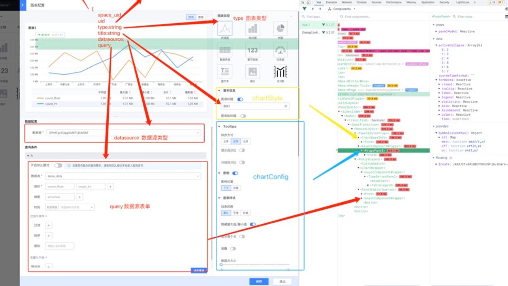

## 图表插件
图表插件为bk-vision带来的不同类型的图表（如饼图、地图、富文本）展示。

**作用**：根据选择图表类型，会展示相应图表配置信息

比如说 当你选择折线图时，会展示出 tootips，legend等线图相关的配置

bk-vision 作为数据可视化 图表配置平台，集成到bk-vision的图表插件必须包含
+ 图表配置面板组件 （PropsPanel）
+ 图表展示组件 （ChartPanel）

下面以仪表盘图表组件为例

### 仪表盘图表插件

```
| -- plugins
  |-- charts 数据源插件
    |-- index.ts entry
    |-- gauge msyql数据源插件
      |-- plugin.json  仪表盘图表插件 元数据 信息
      |-- index.ts 插件入口
      |-- config 数据处理类
        |-- renderGaugeData.ts  查数据源查询的数据，转到到比如echars 的opitons 配置项
      |-- components 
        |-- ChartPanel.tsx 图表渲染组件 （展示图表调用的组件）
        |-- PropsPanel.tsx 配置图表参数组件
      |-- img
        |-- logo.svg          
```
#### 图表数据说明

bk-vision的图表数据结构如下：

```typescript
export class PanelModel<
  Datasource = DatasourceMysql, Query = QueryMysqlSimple, ChartConfig = ChartConfigForm
  > implements IPanelModel<Datasource, Query, ChartConfig> {
  uid: string;
  space_uid?: string;
  // 图表类型 如 line-chart bar-chart status-chart group
  type: string;
  active?: string;
  permissions: PermissionUser;
  // 图表title
  title: string;
  sub_title: string;
  data_type: string;
  // 是否内置插件
  build_in: boolean;
  meta: BaseMetaInfo;
  // 图表位置
  gridPos = new IGridPos();
  filters?: FilterType[] = [];
  // 图表配置
  options?: PanelModelOptions;
  // 图表数据源
  datasource: Datasource;
  // 图表query配置
  query: Query[];
  // 组内视图列表
  panels?: IPanelModel[] | PanelModel[];
  chartStyle = new ChartStyle();
  chartConfig: ChartConfig;
  // 是否正在drag中
  dragging = false;
  // 是否折叠
  collapsed?: boolean = false;

  constructor(model?: Record<string, any>) {
    if (model) {
      Object.assign(this, model);
      if (!this.chartStyle || JSON.stringify(this.chartStyle) === '{}') {
        this.chartStyle = new ChartStyle();
      }
      this.updateGridPos(model.gridPos);
    }
  }

  public updateGridPos(v: IGridPos) {
    if (this.type === 'row') {
      this.gridPos = {
        ...v,
        w: GRID_COL_NUM,
        h: 1,
        minH: 1,
        minW: GRID_COL_NUM,
        maxH: 1,
        maxW: GRID_COL_NUM,
        i: this.uid,
      };
      return;
    }
    if (this.type === 'tab') {
      this.gridPos = {
        ...v,
        w: GRID_COL_NUM,
        minH: GRID_CELL_MIN_HEIGHT,
        minW: GRID_COL_NUM,
        maxH: 100,
        maxW: GRID_COL_NUM,
        i: this.uid,
      };
      return;
    }
    this.gridPos = {
      ...v,
      minH: GRID_CELL_MIN_HEIGHT,
      minW: GRID_CELL_MIN_WIDTH,
      maxH: GRID_CELL_MAX_HEIGHT,
      maxW: GRID_COL_NUM,
      i: this.uid,
    };
  }
}

```

+ 图表的配置数据（如echarts 配置项） 想数据 保存在  `chartConfig`，
由 PropsPanel配置（实际就是 `chartConfig` 表单)
+ 图表全局样式（如标题是否展示、边框设置等配置) 保存在 `chartStyle`，这个有bk-vision提供

##### ChartPanel.tsx

```typescript
const props = {
  panelModel: {
    type: Object as PropType<IPanelModel>,
    required: true,
  },
  // 图表渲染数据
  chartData: {
    type: Object as PropType<ChartData>,
    required: true,
  },
  // 图表主题
  chartStyle: {
    type: Object as PropType<ChartStyle>,
    required: true,
  },
};
```
bk-vision 平台传给图表插件 `数据源插件 query的的数据` (参考：  [图表接口说明](../api/Charts))
渲染出图表
> 建议chartData 到图表渲染数据  封装在 hooks 里面，这样利于图表插件 适配不同的 图表库（如echarts、antV、D3等)


##### PropsPanel.tsx
图表配置表单组件

##### 图表编辑说明
具体参看

