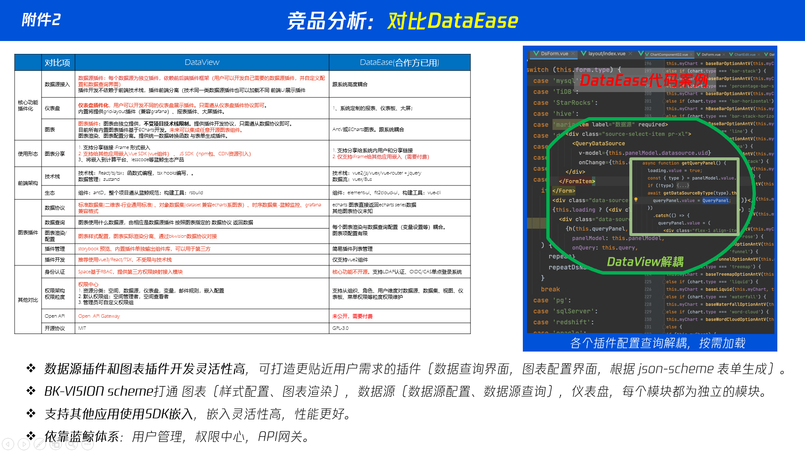

DataEase作为国产开源的数据集可视化BI工具，我们与其对比如下：


# 迁移可能性探讨
+ 前端层面，布局可以通过我们的脚本顺利迁移
+ 数据层面，需要再在数据集上面做进一步沟通。
> 具体设计方面，请查看DataView的前端系统架构设计文档、接口设计文档。 

我们提供迁移服务，迁移方案如下：

## 仪表盘层级
仪表盘的关键属性对照表

| DataView属性            | 属性说明                                 | 映射属性        |
|------------------------|--------------------------------------|-------------|
| title                  | 标题                                   | name        |
| panels                 | 图表列表                                 | view_list   |
| filters                | 面板筛选变量                               | inst_filter |
| build_in               | 是否内置（仪表盘）                            | --          |
| type                   | 仪表盘类型（大屏、网格布局、列表布局）                  | --          |
| colors                 | 面板使用的图表主题色彩（用户可以自定义）                 | --          |
| style                  | 面板样式，具体查看DataView 图表与仪表盘(通用配置) 样式设置 | --          |
| actionMapPanelRelation | 图表与交互组件的关系（比如筛选器、时间选择器应图表之前的关系）      | --          |
| panel_links            | 图表联动关系                               | --          |


#### 为什么DataView 关系直接保存在面板中而不是图表中。
+ panel_links：图表联动关系
+ actionMapPanelRelation：交互组件与图表的联动关系。
#### 原因：
- 因为不同仪表盘的图表关系 表现形式不一样。比如栅格布局（grid-layout)与卡片布局（列表模式），交互形式不一样。
- 比如交互组件与图表之间的关系。可能存在需要先查询交互组件，再渲染图表（交互组件未渲染完成前，相关图表需要等待）。把相关的关系直接存在hash表里面，布局渲染时候可以直接获取相关信息。
- 关系在编辑完成后直接确认好，单纯查看面板，相关的关系计算更加简单。也无需关系相关的事件传递考量。

## 图表层级
图表的关键属性对照表

title 图表标题  name
sub_title 图表副标题（描述信息）  --
type  图表类型（如折线图、柱状图……) type
mode  插件模型（可以是交互组件、仪表盘） --
category  插件类型（比如折线图、柱状图都属于柱线图；饼图、玫瑰图都属于饼图) --
data_type  数据类型 --


| DataView属性名  | 类型 | 描述 | 对标属性      |
|---------------| --- | --- |-----------|
| uid           | string | 图表唯一标识 | --        |
| space_uid     | string | 空间uid | --        |
| type          | string | 图表类型，如 line-chart bar-chart status-chart | type      |
| category      | string | 图标分类，如折线图与柱状图都属于柱线图这个分类，具体分类有：多媒体、柱线图、地图 | widget？   |
| mode          | string | 插件模型，如：chart（图表类）、action（交互类） | --        |
| title         | string | 图表title | name      |
| sub_title     | string | 副标题 | --        |
| description   | string | 图表描述 | --        |
| data_type     | string | 图表数据类型（比如时序图采用points格式，其它用row格式），具体查看 数据源查询API 数据类型结构。 | --        |
| build_in      | boolean | 是否内置插件 | --        |--|
| meta          | BaseMetaInfo | 图表元数据 | --        |
| father_uid    | string | 图表父级uid | --        |
| gridPos       | IGridPos | 图表位置 | x、y、z等    |
| filters       | FilterType[] | 图表内置变量 | --        |
| dataset       | PanelModelDataSet | 数据集 | --        |
| query         | QueryPanelClass | 图表query配置 | trinoDesc |
| panels        | PanelModel[] | 组内视图列表 | --        |
| chartStyle    | ChartStyle | 图表样式配置 | --        |
| chartConfig   | ChartConfig | 图表属性配置项 |config|
| advanceConfig | AdvanceConfig | 图表高级配置项 |--|
| collapsed     | boolean | 是否折叠 |--|


### 图表属性子对象说明


## **IGridPos**
图表布局信息封装在 gridPos 里面。
+ 这个合grafana等平台保持一致。
+ 因为不同图表类型，图表的最大值、最小值、是否可拖动、可改变尺寸等的默认值不同。
+ 这个里面属性本身较多，封装起来，代码逻辑更加清晰。
+ 图表不止网格布局，还有可能是大屏布局。不同仪表盘，IGridPos有不同的Class 生成。

| 属性名 | 类型 | 默认值 | 描述 |
| ------- | ------ | ------- | ------ |
| i | string | '0' | id |
| x | number | 0 | 左边距，类似left，默认1 = 30px |
| y | number | 0 | 上边距，类似top，默认1 = 30px |
| w | number | 12 | 宽度，100% 分为24分，24即为100% |
| h | number | 6 | 高度，默认1 = 30px |
| maxW | number | undefined | GRID_COL_NUM | 最大宽度 |
| maxH | number | undefined | GRID_CELL_MAX_HEIGHT | 最大高度 |
| minW | number | undefined | GRID_CELL_MIN_WIDTH | 最小宽度 |
| minH | number | undefined | GRID_CELL_MIN_HEIGHT | 最小高度 |
| static | boolean | undefined | - | - |
| moved | boolean | undefined | - | - |
| isDraggable | boolean | undefined | - | - |
| isResizable | boolean | undefined | - | - |

## chartConfig
图表配置属性配置，表格echarts、表格等属性配置。由不同的图表的表单 From（class）生成，这个封装在图表插件中（Form对于 PropsPanel表单UI提供用于配置表单）。具体查看DataView文档。
## advanceConfig
图表设置的高级配置。具体查看DataView文档。
## query
DataView分为简易模式，指标维度配置参数和图表插件的元数据有逻辑关系。不同插件的元素数据，query配置不一样。具体查看DataView文档。
sql模式 ，感觉可以迁移  trinoDesc。这个具体需要后台看怎么做数据映射。

## ** ChartStyle**
图表样式设置，如是表框样式设置、主题色等设置、标题样式设置等。

| 属性名 | 类型 | 默认值 | 描述 |
| ------- | ------ | ------- | ------ |
| border | object | {color: '#000', width: 1, style: 'none', radius: 0} | - |
| info | ChartStyleInfo | new ChartStyleInfo() | - |
| background | object | {color: '#fff', position: 'center', size: 'contain', repeat: 'no-repeat', showBgImg: false, localUrl: '', url: '', bgType: 'local', opacity: 30} | - |


### **ChartStyleInfo**

| 属性名 | 类型 | 默认值 | 描述 |
| ------- | ------ | ------- | ------ |
| title | ChartStyleInfoMeta | new ChartStyleInfoMeta('#313238') | - |
| sub_title | ChartStyleInfoMeta | new ChartStyleInfoMeta('#979BA5', false) | - |
| description | ChartStyleInfoMeta | new ChartStyleInfoMeta('#ffffff', false) | - |


####  ** ChartStyleInfoMeta**

| 属性名 | 类型 | 默认值 | 描述 |
| ------- | ------ | ------- | ------ |
| show | boolean | true | - |
| color | string | '#979BA5' | - |
| align | string | 'start' | - |

## **PanelModelDataSet**

| 属性名 | 类型 | 默认值 | 描述 |
| ------- | ------ | ------- | ------ |
| dataset_uid | string | '' | - |
| datasource_uid | string | '' | - |
| db_type | keyof typeof DatasourceTypeEnum | null | - |

图表数据设置

## 嘉为的数据结构：
```json
{
  "name": "仪表盘",
  "time_range": "15",
  "range_type": "minute",
  "config_set": {
    "searchTxt": "",
    "refreshTime": 0
  },
  "inst_filter": [],
  "view_list": [
    {
      "h": 6,
      "i": 0,
      "w": 12,
      "x": 0,
      "y": 0,
      "name": "表格",
      "type": "log-table",
      "moved": false,
      "widget": "log-table",
      "loading": false,
      "isRefresh": false,
      "config": {
        "name": "统计分析: filebeat_log_file_path",
        "dashboard_id": 117,
        "bk_obj_id": "",
        "metric": "",
        "metric_id": "",
        "table_id": "",
        "aggregate_type": "",
        "view_type": "log-table",
        "threshold_compare": "",
        "threshold_value": "",
        "threshold_unit": "",
        "logParams": {
          "group": [
            {
              "unit": "minutes",
              "field": "filebeat_log_file_path",
              "limit": 15,
              "duration": 1,
              "direction": "column",
              "isDateType": false
            }
          ],
          "order": [],
          "barMode": "group",
          "measure": [
            {
              "name": "",
              "type": "count",
              "field": "filebeat_log_file_path",
              "isPercentile": false
            }
          ],
          "logGroup": [
            "650164a49fe5d37840eefccb"
          ],
          "trendDirect": "up",
          "aceEditorVal": "*",
          "columnRollup": true,
          "trendChecked": false
        }
      }
    },
    {
      "h": 10,
      "i": 1,
      "w": 6,
      "x": 0,
      "y": 6,
      "id": 0,
      "name": "表格",
      "type": "senior-table",
      "moved": false,
      "widget": "senior-table",
      "isRefresh": true,
      "config": {
        "name": "trino高级-表格",
        "dashboard_id": 117,
        "bk_obj_id": "",
        "metric": "",
        "metric_id": "",
        "table_id": "",
        "aggregate_type": "",
        "view_type": "senior-table",
        "threshold_compare": "",
        "threshold_value": "",
        "threshold_unit": "",
        "showAsset": false,
        "threshold": {
          "sign": "=",
          "color": "#E51407",
          "value": ""
        },
        "trinoDesc": "SELECT \n  CASE WHEN src < dst THEN src ELSE dst END AS src,\n  CASE WHEN src < dst THEN dst ELSE src END AS dst,\n  SUM(c) AS total_c\nfrom Table(datainsight.system.query(streams=>'netflow',type=>'sql',query=>'select nf_src_address as src, nf_dst_address as dst,count(*) as c from $index where nf_src_address is not null and nf_dst_address is not null and nf_src_address!=\\\"0.0.0.0\\\" and nf_dst_address!=\\\"0.0.0.0\\\" group by nf_src_address,nf_dst_address order by count(*) desc limit 50'))\nGROUP BY \n  CASE WHEN src < dst THEN src ELSE dst END,\n  CASE WHEN src < dst THEN dst ELSE src END",
        "sourceField": "",
        "targetField": "",
        "measureField": ""
      }
    }
  ]
}
```
## DataView数据结构
```json
{
  "id": 645,
  "uid": "3aLLE6Ga86wuNy2ZqWVgav",
  "space_uid": "35Rscji7obpKvy7uVpv82u",
  "version": "V4",
  "title": "新建测试-andy",
  "build_in": true,
  "panels": [
    {
      "id": 1701,
      "uid": "UJBT4JgYuqsaUHwzqE2eyt",
      "mode": "chart",
      "type": "pie-charts",
      "query": {
        "limit": {
          "size": 100,
          "offset": null
        },
        "order": [],
        "where": [],
        "format": "row",
        "metrics": [
          {
            "uid": "3XaAuYB4MSwQbhtJN9nt4S",
            "name": "count_float",
            "type": "float",
            "table": null,
            "remark": "",
            "map_uid": "",
            "raw_name": "count_float",
            "aggregate": "SUM",
            "is_joined": false,
            "is_virtual": false,
            "dataset_uid": "3W7brG9NDv6XMUoaMCFgXJ",
            "display_name": "count_float"
          }
        ],
        "raw_query": false,
        "space_uid": "35Rscji7obpKvy7uVpv82u",
        "variation": [],
        "dimensions": [
          {
            "uid": "JjFd2dznQxxjcTgMyWFTJS",
            "name": "province",
            "type": "",
            "table": null,
            "remark": "",
            "map_uid": "",
            "raw_name": "province",
            "aggregate": null,
            "is_joined": false,
            "is_virtual": false,
            "dataset_uid": "3W7brG9NDv6XMUoaMCFgXJ",
            "display_name": "province"
          }
        ],
        "drill_down": [],
        "is_drilled": false,
        "query_text": ""
      },
      "title": "仪表盘",
      "dataset": {
        "dataset_uid": "3W7brG9NDv6XMUoaMCFgXJ",
        "datasource_uid": "4XJtRKmBAWGAFBR4ttLdwY"
      },
      "filters": [],
      "gridPos": {
        "h": 6,
        "i": "UJBT4JgYuqsaUHwzqE2eyt",
        "w": 12,
        "x": 5,
        "y": 0,
        "maxH": 10000,
        "maxW": 24,
        "minH": 2,
        "minW": 3,
        "moved": false
      },
      "build_in": true,
      "category": "Gauge",
      "collapsed": false,
      "data_type": "row",
      "space_uid": "35Rscji7obpKvy7uVpv82u",
      "sub_title": "",
      "chartStyle": {
        "info": {
          "title": {
            "show": true,
            "align": "start",
            "color": "#313238"
          },
          "sub_title": {
            "show": true,
            "align": "start",
            "color": "#979BA5"
          },
          "description": {
            "show": true,
            "align": "start",
            "color": "ffffff"
          }
        },
        "border": {
          "color": "#000",
          "style": "none",
          "width": 1,
          "radius": 2
        },
        "background": {
          "url": "",
          "size": "cover,contain",
          "color": "",
          "repeat": "no-repeat",
          "position": "center"
        }
      },
      "chartConfig": {
        "pie": {
          "type": "pie",
          "center": [
            "50%",
            "50%"
          ],
          "radius": [
            20,
            40
          ],
          "borderRadius": false
        },
        "colors": {
          "color": []
        },
        "legend": {
          "hide": false,
          "position": "bottom"
        },
        "visual": {
          "unit": "",
          "label": true,
          "other": "其他",
          "unfold": false,
          "labelAlign": "none",
          "unfoldName": "其他",
          "unfoldType": "asc",
          "unfoldNumber": 10
        },
        "tooltip": {
          "show": true,
          "order": "valueDesc",
          "percentageType": "percentage",
          "showPercentage": false
        },
        "numberDisplayRules": []
      },
      "description": "",
      "child_panels": [],
      "created_time": "2023-09-15 10:12:28",
      "updated_time": "2023-09-15 17:05:41",
      "created_by": "andyljzhou",
      "updated_by": "andyljzhou",
      "father_uid": "",
      "data": {
        "chartStyle": {
          "info": {
            "title": {
              "show": true,
              "align": "start",
              "color": "#313238"
            },
            "sub_title": {
              "show": true,
              "align": "start",
              "color": "#979BA5"
            },
            "description": {
              "show": true,
              "align": "start",
              "color": "ffffff"
            }
          },
          "border": {
            "color": "#000",
            "style": "none",
            "width": 1,
            "radius": 2
          },
          "background": {
            "url": "",
            "size": "cover,contain",
            "color": "",
            "repeat": "no-repeat",
            "position": "center"
          }
        },
        "AdvanceConfig": {}
      }
    },
    {
      "id": 1715,
      "uid": "nfEp8hwqwojU94LeFbbUXg",
      "mode": "chart",
      "type": "time-series",
      "query": {
        "limit": {
          "size": 100,
          "offset": null
        },
        "order": [],
        "where": [],
        "format": "point",
        "metrics": [
          {
            "uid": "3XaAuYB4MSwQbhtJN9nt4S",
            "name": "count_float",
            "type": "float",
            "table": null,
            "remark": "",
            "map_uid": "",
            "raw_name": "count_float",
            "aggregate": "SUM",
            "is_joined": false,
            "is_virtual": false,
            "dataset_uid": "3W7brG9NDv6XMUoaMCFgXJ",
            "display_name": "count_float"
          }
        ],
        "raw_query": false,
        "space_uid": "35Rscji7obpKvy7uVpv82u",
        "variation": [],
        "dimensions": [
          {
            "uid": "JjFd2dznQxxjcTgMyWFTJS",
            "name": "province",
            "type": "",
            "table": null,
            "remark": "",
            "map_uid": "",
            "raw_name": "province",
            "aggregate": null,
            "is_joined": false,
            "is_virtual": false,
            "dataset_uid": "3W7brG9NDv6XMUoaMCFgXJ",
            "display_name": "province"
          }
        ],
        "drill_down": [],
        "is_drilled": false,
        "query_text": ""
      },
      "title": "仪表盘-copy",
      "dataset": {
        "dataset_uid": "3W7brG9NDv6XMUoaMCFgXJ",
        "datasource_uid": "4XJtRKmBAWGAFBR4ttLdwY"
      },
      "filters": [],
      "gridPos": {
        "h": 6,
        "i": "nfEp8hwqwojU94LeFbbUXg",
        "w": 12,
        "x": 5,
        "y": 6,
        "maxH": 10000,
        "maxW": 24,
        "minH": 2,
        "minW": 3,
        "moved": false
      },
      "build_in": true,
      "category": "Gauge",
      "collapsed": false,
      "data_type": "row",
      "space_uid": "35Rscji7obpKvy7uVpv82u",
      "sub_title": "",
      "chartStyle": {
        "info": {
          "title": {
            "show": true,
            "align": "start",
            "color": "#313238"
          },
          "sub_title": {
            "show": true,
            "align": "start",
            "color": "#979BA5"
          },
          "description": {
            "show": true,
            "align": "start",
            "color": "ffffff"
          }
        },
        "border": {
          "color": "#000",
          "style": "none",
          "width": 1,
          "radius": 2
        },
        "background": {
          "url": "",
          "size": "cover,contain",
          "color": "",
          "repeat": "no-repeat",
          "position": "center"
        }
      },
      "chartConfig": {
        "Axis": {
          "name": "",
          "rotate": 0,
          "interval": null,
          "inverted": false,
          "xAxisMax": null,
          "xAxisMin": null,
          "yAxisMax": null,
          "yAxisMin": null,
          "threshold": [],
          "yAxisUnit": {
            "choice": [
              "Misc",
              "short"
            ],
            "custom": ""
          },
          "splitNumber": 5,
          "yAxisValueType": "bar",
          "xAxisTimeFormat": null,
          "isHideSplitLineY": false,
          "yAxisValuePosition": 0
        },
        "label": {
          "show": false,
          "rotate": 0,
          "position": "top",
          "showYLine": true
        },
        "colors": {
          "color": []
        },
        "legend": {
          "hide": false,
          "position": "bottom"
        },
        "visual": {
          "stack": false,
          "ladder": false,
          "padding": false,
          "lineType": "linear",
          "direction": "vertical",
          "lineWidth": 2,
          "showTotal": false,
          "symbolSize": 0,
          "emptyHandler": "",
          "stackStrategy": "samesign",
          "paddingOpacity": 0,
          "withoutKeyPoints": true
        },
        "tooltip": {
          "show": true,
          "order": "valueDesc",
          "percentageType": "percentage",
          "showPercentage": false
        },
        "AxisSecond": {
          "name": "",
          "rotate": 0,
          "interval": null,
          "inverted": false,
          "xAxisMax": null,
          "xAxisMin": null,
          "yAxisMax": null,
          "yAxisMin": null,
          "threshold": [],
          "yAxisUnit": "",
          "splitNumber": 5,
          "yAxisValueType": "bar",
          "xAxisTimeFormat": null,
          "isHideSplitLineY": false,
          "yAxisValuePosition": 0
        },
        "statistics": {
          "avg": true,
          "max": true,
          "min": true,
          "show": false,
          "total": true,
          "latest": true,
          "position": "bottom"
        },
        "numberDisplayRules": []
      },
      "description": "",
      "child_panels": [],
      "advanceConfig": {},
      "created_time": "2023-09-16 22:59:32",
      "updated_time": "2023-09-16 22:59:44",
      "created_by": "andyljzhou",
      "updated_by": "andyljzhou",
      "father_uid": "",
      "data": {
        "chartStyle": {
          "info": {
            "title": {
              "show": true,
              "align": "start",
              "color": "#313238"
            },
            "sub_title": {
              "show": true,
              "align": "start",
              "color": "#979BA5"
            },
            "description": {
              "show": true,
              "align": "start",
              "color": "ffffff"
            }
          },
          "border": {
            "color": "#000",
            "style": "none",
            "width": 1,
            "radius": 2
          },
          "background": {
            "url": "",
            "size": "cover,contain",
            "color": "",
            "repeat": "no-repeat",
            "position": "center"
          }
        },
        "AdvanceConfig": {}
      }
    }
  ],
  "filters": [],
  "colors": {},
  "style": {
    "info": {
      "title": {
        "show": true,
        "align": "start",
        "color": "#313238"
      },
      "sub_title": {
        "show": true,
        "align": "start",
        "color": "#979BA5"
      },
      "description": {
        "show": true,
        "align": "start",
        "color": "ffffff"
      }
    },
    "border": {
      "color": "#ffffff",
      "style": "solid",
      "width": 0,
      "radius": 0,
      "shadow": "0 2px 4px 0 rgb(25 25 41 / 5%)"
    },
    "background": {
      "url": "",
      "size": "cover,contain",
      "color": "",
      "repeat": "no-repeat",
      "position": "center"
    }
  },
  "actionMapPanelRelation": {},
  "data": {
    "panel_links": []
  },
  "panel_links": [],
  "collected": true
}
```

