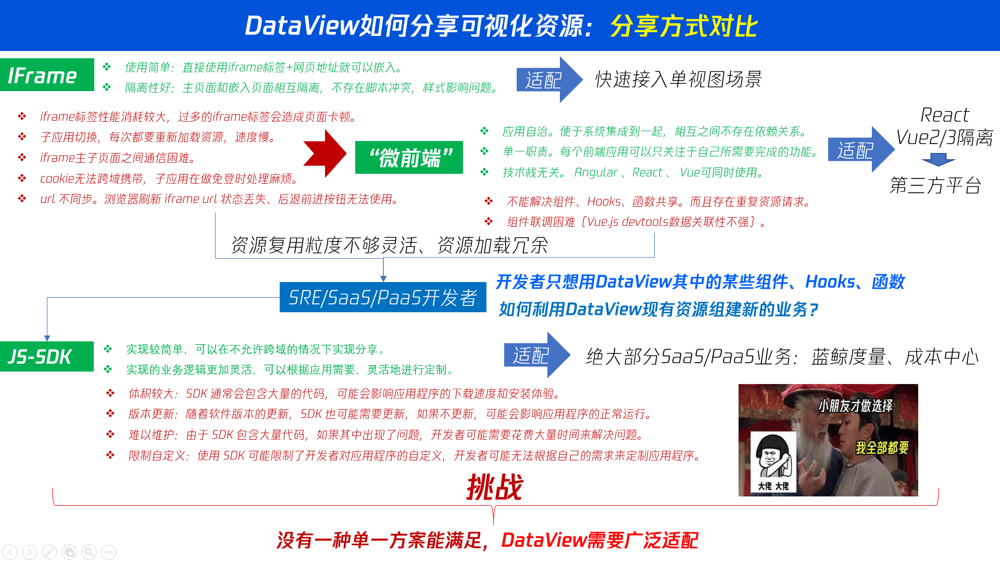
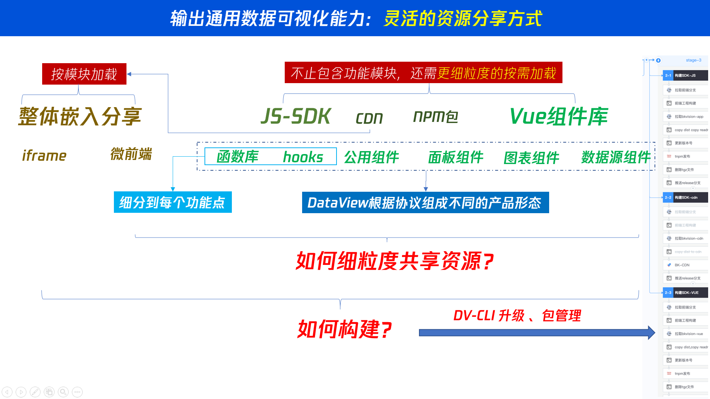
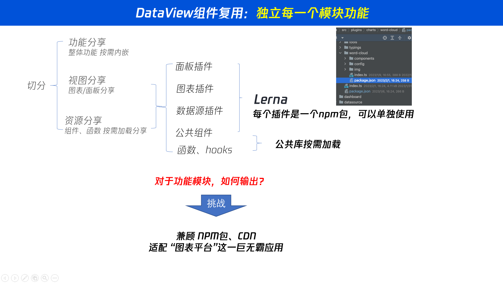

# 仪表盘嵌入分享

DataLuminary 将仪表盘做成可嵌入的原子资源：企业客户可在自有系统（Vue / React / Angular / JSP 等）中以多种方式挂载 DataView 仪表盘，并配合 Token、空间与启停控制做权限隔离。

产品入口：**空间 → 分享 → 仪表盘嵌入管理**。

> 图表（Panel）嵌入、访问日志、React 组件嵌入、Veaury 桥接本期未开放。

### 在线演示

| 资源 | 链接 |
|------|------|
| **演示站** | [https://demo.dataluminary.dev](https://demo.dataluminary.dev) — iframe / JS SDK / Micro App / Wujie 四种嵌入实况 |
| **源码** | [github.com/DataLuminary/share-demo](https://github.com/DataLuminary/share-demo) |

演示站默认使用环境变量中的固定 `shareUid` + `token`；页面上也可自行填写联调。MetaRepo 本地：`pnpm --dir share-demo install && pnpm dev:share-demo`。

---

## 配置流程（产品侧）

嵌入配置分三步，保存后自动生成宿主页可用的代码片段：

| 步骤 | 内容 |
|------|------|
| **1. 基本信息** | 选择仪表盘、版本（`latest` 或指定版本）、是否显示水印；右侧提供效果预览 |
| **2. 嵌入方式** | 选择 iframe / JS SDK / Micro App / Wujie；除 iframe 外配置跨域 |
| **3. 嵌入代码** | 只读预览 + 一键复制；列表页也可再次复制 |

列表支持：按仪表盘名称搜索、启停（`publish` / `pause`）、编辑、删除、复制代码。停用后公开令牌失效，嵌入页无法换取会话。

---

## 嵌入方式

| 方式 | 状态 | 说明 | 跨域 |
|------|------|------|------|
| **iframe** | 已支持 | 原生 iframe 指向公开嵌入页，隔离强、接入最快 | 一般无需额外配置（`corsMode: none`） |
| **JS SDK（CDN）** | 已支持 | `window.Luminary.embed` 在宿主容器内创建 iframe 并挂载嵌入页 | 推荐反向代理 |
| **Micro App** | 已支持 | 以京东 Micro App 子应用方式加载嵌入页（生成代码依赖宿主引入 Micro App） | 推荐反向代理 |
| **无界 Wujie** | 已支持 | 以 Wujie 微前端加载嵌入页（生成代码依赖宿主引入 Wujie） | 推荐反向代理 |
| React 组件 | 规划中 | 以 npm / 组件形式挂载 | — |
| Veaury 桥接 | 规划中 | Vue / React 互操作桥接 | — |

选型原则不是「哪个微前端最好」，而是：**隔离能力 + 接入成本 + 企业兼容性**。当前产品优先交付「零改造 / 低侵入」的 iframe、CDN SDK，以及同样以嵌入页 URL 为入口的 Wujie / Micro App 代码模板。更细的框架对比见下文 [微前端选型说明](#微前端选型说明)。

---

## 跨域设置

除 **iframe** 外，宿主页与 DataTalk API 不同源时需要跨域方案。产品内提供两种选项：

### 1. 反向代理（推荐，已支持）

请在贵司网关 / Nginx / Ingress 上将 DataLuminary 官方域名（例如 `*.dataluminary.dev`，**含 DataView 前端与 DataTalk API**）反向代理到自有同源路径。浏览器请求与页面同源后即可免 CORS。

嵌入代码中的 `proxy` 填写**代理后的 DataTalk 基址**，例如：

```text
https://your-domain.com/datatalk
```

公开嵌入页会把该地址作为 API `baseURL`，用其请求 DataTalk（含换取分享会话与后续查询）。

### 2. 跨域域名设置（规划中）

产品界面已预留入口，当前置灰（功能待开放）。

规划：按 **空间（space）** 在 Fastify / DataTalk 侧动态设置 `Access-Control-Allow-Origin`。域名与空间绑定，因此在后端做跨域拦截，而不采用 Cloudflare Workers 边缘动态 CORS，也不采用 Nginx Lua 动态 CORS。

---

## JS SDK（CDN）

当前交付的是 **浏览器 CDN / UMD** 形态（`window.Luminary.embed`）。源码与构建在 DataView 仓库 `packages/sdk`（包名 `@dataluminary/sdk`）。  
npm 侧 `import { LuminaryClient } from '@dataluminary/sdk'` 一类的 SPA 挂载用法为后续规划；本期分享代码生成只输出 CDN 脚本。

### 发布与版本地址

通过 DataView 仓库 GitHub Actions 手动发版（`.github/workflows/release-gh.yml`）：

1. Actions → **Release SDK (jsDelivr)** → Run workflow → 填入 tag（如 `v1.0.1`）
2. CI 打包 `dist`、提交产物、创建 `sdk-v1.0.1`，并移动浮动标签 `sdk-latest`
3. 通过 [jsDelivr](https://cdn.jsdelivr.net) 的 GitHub 端点访问：

| 用途 | URL |
|------|-----|
| **分享代码默认（跟最新）** | `https://cdn.jsdelivr.net/gh/DataLuminary/DataView@sdk-latest/packages/sdk/dist/luminary.min.js` |
| 固定版本 | `https://cdn.jsdelivr.net/gh/DataLuminary/DataView@sdk-v1.0.1/packages/sdk/dist/luminary.min.js` |

产品内生成的 JS SDK 嵌入代码默认使用 `@sdk-latest`，宿主页一般无需因 SDK 小版本升级而改代码（注意 jsDelivr 对浮动 tag 有缓存）。需要锁版本时改用 `@sdk-vX.Y.Z`。本地 / 开发可回退到 DataView 同源 `/sdk/luminary.js`（`pnpm build:sdk` 同步）。环境变量 `PUBLIC_SDK_CDN_URL` 可覆盖产品内生成的脚本地址。

### 使用示例

```html
<div id="dashboard" style="width:100%;min-height:640px;"></div>
<script src="https://cdn.jsdelivr.net/gh/DataLuminary/DataView@sdk-latest/packages/sdk/dist/luminary.min.js"></script>
<script>
  window.Luminary.embed({
    container: "#dashboard",
    // 反向代理后的 DataTalk 基址（可选；与产品「跨域 → 反向代理」一致）
    proxy: "https://your-domain.com/datatalk",
    token: "xxx",
    dashboard: "share-uid",
    appOrigin: "https://app.dataluminary.dev",
  });
</script>
```

参数说明：

| 参数 | 含义 |
|------|------|
| `container` | CSS 选择器或 DOM 节点 |
| `token` | 该分享配置的公开访问令牌 |
| `dashboard` | **分享配置 uid**（不是仪表盘业务 id） |
| `proxy` | 可选；嵌入页以此为 DataTalk API `baseURL` |
| `appOrigin` | DataView 应用源站；jsDelivr 场景下**务必显式传入**（否则无法从脚本 origin 推断） |
| `width` / `height` | 可选；iframe 尺寸，默认 `100%` / `640px` |

SDK 本质是创建指向公开嵌入页的 iframe，并透传 `token` / `proxy`；仪表盘渲染仍由 DataView 嵌入页完成。

---

## 公开嵌入页与鉴权

嵌入页路由（DataView）：

```text
#/embed/share/:shareUid?token=...&proxy=...
```

后端公开接口（DataTalk，无需登录）：

| 方法 | 路径 | 说明 |
|------|------|------|
| `GET` | `/share/public/:token` | 解析已发布分享的元数据 |
| `POST` | `/share/public/:token/session` | 换取短期只读 JWT（`scope: share-view`，默认约 2h），用于加载仪表盘与查询 |

嵌入页启动时调用 session 接口，校验 URL 中的 `shareUid` 与 token 对应配置一致，再以会话 Token 渲染 `DashboardContent`。若配置为停用，公开接口返回不可用。

管理端 CRUD（需登录且具备空间权限）包括：`POST /share/search`、`POST /share`、`GET|PUT|DELETE /share/:uid`、启停 `GET /share/:uid/pause|restart`。

---

## 微前端选型说明

目标场景：

- 企业客户已有系统，嵌入 DataLuminary Dashboard
- 权限隔离、多租户、尽量减少客户改造成本

### 方案对比（产品决策背景）

| 框架 | 底层核心 | JS 隔离 | CSS 隔离 | 子应用改造代价 | 适合 BI 嵌入 |
|------|----------|---------|----------|----------------|--------------|
| **Wujie（腾讯）** | Web Components + Iframe | 极高（原生 Iframe） | 极高（Shadow DOM） | 几乎为零 | ⭐⭐⭐⭐⭐ |
| **micro-app（京东）** | Web Components + Proxy | 高 | 高 | 低 | ⭐⭐⭐⭐⭐ |
| Garfish（字节） | 路由劫持 + VM 沙箱 | 高 | 可选 | 较高（生命周期） | ⭐⭐⭐⭐ |
| qiankun（阿里） | 路由劫持 + Proxy | 中等 | 易出弹窗层级问题 | 高（生命周期 + 构建改造） | ⭐⭐⭐ |

**首选对外输出形态：iframe / CDN SDK（物理隔离）**；微前端侧优先提供 **Wujie** 与 **Micro App** 的嵌入代码模板——二者都能以「正常网页 URL」加载 DataView 嵌入页，无需为微前端单独改 DataView 打包生命周期。

为何不把 qiankun / Garfish 作为对外默认方案：

- **强侵入**：要求子应用导出 `bootstrap` / `mount` / `unmount` 等，并调整构建 `libraryTarget`，不适合「开箱即用的 BI 嵌入」。
- **弹窗与样式**：严格 Shadow DOM 下，Ant Design 等默认挂 `document.body` 的浮层易丢样式；关闭严格隔离又易污染宿主。
- **构建兼容**：传统微前端偏 Webpack 时代约束，与 Vite / Rsbuild 主线摩擦更大。

Micro App 相对 Wujie 更轻、组件化接入更简单；在极端复杂 Canvas / 底层 DOM 场景下，Iframe 物理隔离（Wujie / 原生 iframe / 当前 SDK）通常更稳妥。产品同时提供两种代码模板，由客户按宿主技术栈选择。

---

## 与「插件微前端」的关系

DataView 内部还有面向**图表 / 面板插件**的跨框架组合能力（Vue2/3、React、Solid、Svelte 等模板）。那是平台插件体系；本文描述的是**把整页仪表盘嵌入第三方业务系统**的对外分享能力。两者可并存：对外嵌入走分享配置，对内扩展走插件。

背景阅读（可选）：

- [微前端总体架构概述](https://www.zhoulujun.cn/html/webfront/engineer/Architecture/9029.html)
- [无界方案分析](https://www.zhoulujun.cn/html/webfront/engineer/Architecture/9052.html)

历史方案示意（产品愿景图）：







---

## 范围与后续规划

| 能力 | 状态 |
|------|------|
| 仪表盘嵌入列表 / 编辑 / 启停 / 复制代码 | 已验收 |
| iframe / JS SDK CDN / Micro App / Wujie 代码生成 | 已验收 |
| 反向代理 `proxy` | 已验收 |
| 公开页 + `share-view` 短期 JWT | 已验收 |
| SDK jsDelivr 发版（`sdk-latest` / `sdk-v*`） | 已支持 |
| 跨域域名设置（按空间动态 CORS） | 规划中 |
| 图表（Panel）嵌入 | 规划中 |
| React 组件 / Veaury / npm `LuminaryClient` SPA 挂载 | 规划中 |
| 访问日志 | 规划中 |

同目录相关：[分享总览](./index.md) · [订阅推送](./subscription.md)。竞品与迁入：[竞品对比](../migrate/compare.md) · [Grafana 迁入](../migrate/grafana.md) · [DataEase 迁入](../migrate/dataease.md)。
