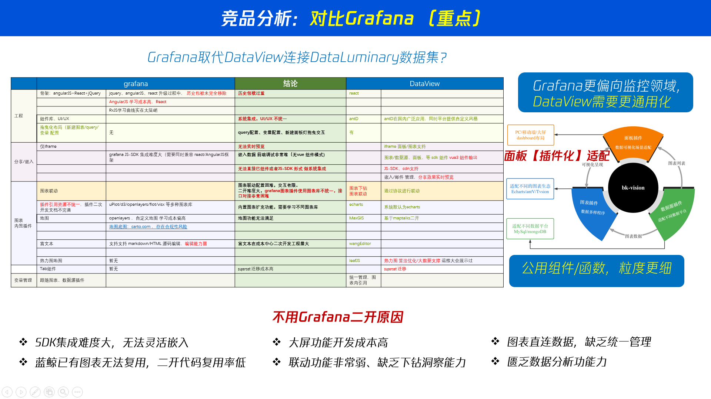

很多客户已经已经接入grafana，为什么要选择DataLuminary呢？

我们作为数据分析平台，更加侧重数据的挖掘与分析。
+ 我们希望用户能够快速清洗数据，构建数据集，搭可视化页面。
+ 我们希望用户能够快速搭建数据分析平台，而不是花费大量时间在数据处理上。
同时我们希望把分析的结果，通过各种形式，让用户利用到自己想要的地方！

# 图表迁移可能性探讨

我们与grafana意义，同样一插件化拓展系统。
## 视图迁移
我们通过微前端的方式，将grafana的插件，迁移到DataLuminary DataView的 grid-layout 面板中。
## 数据迁移
我们虽然保留了和grafana的差不多的插件数据结构，但是我们不推荐直接和grafana一样，直接数据。
> 我们核心价值在于方便用户挖掘数据价值价值

我们更建议用户推荐使用DataLuminary的Datasets 做数据管理。

我们和乐意帮助用户做数据迁移 与  数据挖掘！

