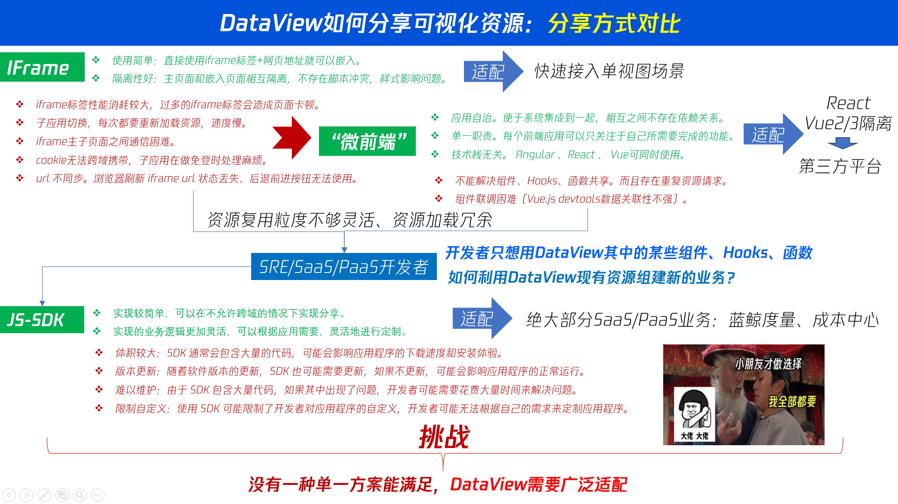

# 共享方案
## 微前端
我通过自研的微前端方案，为前端插件提供Vue2/3、react、solid、svelte等开发模板。

同时，我们也提供了基于微前端的解决方案，让用户可以自由组合插件，实现自己的需求。

同时通过我们的微前端方案，也给第三方平台按需嵌入我们的资源。

> 关于微前端，推荐阅读
: <ul><li>
    <a href="/html/webfront/engineer/Architecture/9029.html" target="_blank">微前端学习笔记（1）：微前端总体架构概述，从微服务发微</a>
</li><li>
<a href="/html/webfront/engineer/Architecture/9052.html" target="_blank">微前端学习笔记(2): 无界方案分析</a>
</li><li>
<a href="/html/webfront/engineer/Architecture/9055.html" target="_blank">微前端学习笔记(3):前端沙箱之JavaScript的sandbox（沙盒/沙箱）</a>
</li><li >
<a href="/html/webfront/engineer/Architecture/9063.html" target="_blank">微前端学习笔记(4):从微前端到微模块之EMP与hel-micro方案探索</a>
</li><li>
<a href="/html/webfront/engineer/Architecture/9066.html" target="_blank">微前端学习笔记(5)：从import-html-entry发微DOM/JS/CSS隔离</a>
</li>
</ul>

当然我们不局限于微前端

用户可以按需实现自己的方案。

为此，我们的所有功能都能原子化共享

## dv-cli 
dv-cli 基于rspack 提供了一个脚手架，用于快速创建一个基于DataLuminary插件模板，各类npm包构建。
